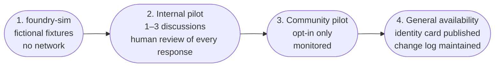
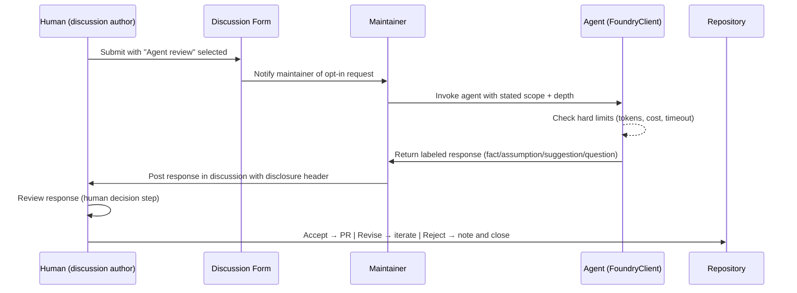

# PRD — AoT Agent Protocol

**Status:** Draft · **Owner:** CurationsX · **Scope:** Opt-in, read-only, disclosed, bounded-spend agent protocol for the Community Grid

> **Product authority:** This permission protocol is subordinate to
> [`PRD-curations-community.md`](PRD-curations-community.md). AI is optional
> guidance and cannot create, approve, or change Project evidence or a human
> outcome. Evidence-specific constraints remain in
> [`PRD-project-evidence-registry.md`](PRD-project-evidence-registry.md).

## 1. Purpose

Define a safe, auditable protocol for deploying a read-only AI agent in the Community Grid — one that is explicitly opt-in, discloses its identity and limits in every session, operates within maintainer-set hard limits, and preserves human primacy over every outcome. This protocol is a prerequisite for any agent deployment in the community board.

**Out of scope for this PRD:** Agent session log capture, storage, or any "view the transcript" surface. ROI and capability assessment come from the `foundry-sim` emulator, not from agent transcripts.

## 2. Background

`community/README.md` documents the release gates for community agent deployment:
- Opt-in invocation (an agent never joins because a link was posted).
- A named human decision owner for every request.
- Maintainer-set hard limits on cost and latency.
- Published identity, permissions, model/provider disclosure, and change log before any pilot.

`docs/ROADMAP.md` lists "Evaluate a read-only agent on public fictional fixtures before any community pilot" as a **Next** milestone. The `foundry-sim/` emulator (see `foundry-sim/README.md`) provides the local, zero-cost staging environment required by that milestone.

## 3. Goals

1. **Define the invocation contract** — how an agent is requested, what it may and may not do, and who owns the outcome.
2. **Specify mandatory disclosures** — identity, model, permissions, cost limits, and change log published in the community before any pilot.
3. **Document hard limits** — per-request token caps, per-run request caps, timeout bounds, and how they are enforced.
4. **Establish the staging gate** — agents must pass evaluation on fictional fixtures via `foundry-sim` before any community pilot.
5. **Protect human agency** — no discussion closes or artifact is published by agent action alone.

## 4. Non-Goals

- Building an autonomous or scheduling agent (all invocations are explicit and human-initiated).
- Capturing, storing, or showcasing agent session logs or transcripts.
- Enabling write access to the repository from an agent.
- Replacing the human decision step in the collaboration loop.
- Unrestricted spend or unbounded model API usage.

## 5. Guiding Principles

| Principle | Meaning |
| --- | --- |
| Explicit invocation | An agent is invited by a human, for a specific request, with a stated scope. |
| Disclosed identity | Every agent session begins with a published disclosure: who the agent is, what model it uses, what it may do, and what its limits are. |
| Bounded spend | Maintainer-set hard limits on tokens, requests, cost, and latency are not advisory; they are enforced at the protocol level. |
| Read-only in community | Agents may read discussions and suggest text. They may not post, label, close, or modify discussions without explicit human confirmation. |
| Human closes | No discussion is resolved, merged, or closed by agent action alone. |
| Staged rollout | Fictional fixture testing → internal pilot → community pilot → general availability. Each stage requires evidence before proceeding. |

## 6. Functional Requirements

### 6.1 Invocation contract

An agent is invoked when:
1. A human explicitly requests agent review in a discussion form (via the "Review requested" field selecting "Agent review" or "Human and agent review").
2. A named human decision owner is identified.
3. The request scope is stated (Focused / Standard / Deep, corresponding to token budget tiers).

An agent is **never** invoked:
- Merely because a discussion was posted or a link was shared.
- Automatically on a schedule without explicit human initiation.
- At a depth exceeding the maintainer-configured maximum.

### 6.2 Mandatory disclosures (published before any pilot)

The agent's identity card must be published in the community (pinned post or wiki) before any pilot:

| Field | Required content |
| --- | --- |
| Agent name | A stable, named identifier (not just "the AI") |
| Model and provider | Exact model ID and hosting provider |
| Permissions | What the agent may read, suggest, and (with confirmation) act on |
| Hard limits | Max tokens/request, max requests/run, max cost/run, timeout |
| Change log | Date, change description, and human approver for each capability update |
| Contact | Named human maintainer responsible for the agent |

### 6.3 Hard limits (defaults; maintainer sets actuals)

| Limit | Default | Notes |
| --- | --- | --- |
| Max output tokens / request | 2,048 | Maintainer may raise to 4,096 with justification |
| Max requests / run | 10 | One "run" = one discussion thread response |
| Max estimated cost / run | USD 0.10 | Enforced at protocol level; run aborts if exceeded |
| Request timeout | 30 s | Per API call; fail-open (surfaces error, does not silently hang) |
| Model allowlist | First-party Azure OpenAI only | See `docs/PRD-azure-foundry-integration.md` §5 |

These limits are documented in the agent's identity card. Changing them requires a change-log entry and human approver.

### 6.4 Staging gate

Before any community pilot, the agent must complete the following stages:

Evidence required at each stage:
1. **Sim stage:** All `foundry-sim` tests pass (`python -m unittest foundry-sim/tests/test_sim.py -v`); dashboard displays correct topology and ESTIMATE cost.
2. **Internal pilot:** ≥ 3 discussions exercised with human review of every response; no false completions, no cost overruns, no unauthorized actions.
3. **Community pilot:** Opt-in only; response quality and human decision logs reviewed after ≥ 10 discussions.
4. **GA:** Identity card and change log published; maintainer named; limits documented.

### 6.5 Response contract

Every agent response in a discussion must:
- Begin with a disclosure line: `🤖 [Agent name] · [Model ID] · [Depth: Focused/Standard/Deep] · [Simulated|Live]`
- Label each element: **fact**, **assumption**, **suggestion**, or **open question**.
- End with: `Human decision required — the named owner accepts, rejects, or adapts this response.`
- Not include claims about pricing, model capabilities, or external systems without a cited source.

### 6.6 Auto mode and Copilot engines

In `auto` profile (the default in `foundry-sim`), the agent does not pin a specific paid model. The Copilot auto engine routes to the best available first-party model for the request. The protocol's hard limits apply regardless of which model is routed to. The maintainer builds out personas and workflow logic on top of the auto routing; the protocol does not assume or depend on a specific model.

## 7. Mermaid: Agent invocation flow

## 8. Success Criteria

- Agent identity card published before any community pilot.
- All sim tests pass before any real invocation.
- Zero agent-initiated discussion closures or PR merges without human confirmation.
- Hard limits enforced: no run exceeds the configured token, request, or cost cap.
- Change log maintained with at least one entry per capability update.

## 9. Open Questions

- ~~Which model deployment will be used for the first internal pilot?~~ **Resolved: `gpt-5.4-mini` (2026-03-17) on `yolo-foundry` — see `community/AGENT-IDENTITY-CARD.md`.**
- ~~How is the agent's identity card versioned — as a file in the repository or a pinned discussion?~~ **Resolved: repository file `community/AGENT-IDENTITY-CARD.md` with an in-file change log.**
- ~~What happens if the hard limit is hit mid-response — truncate or abort and notify?~~ **Resolved: limits are checked *before* each send; the run aborts with `ProtocolLimitError` and notifies. Output-token budgets are enforced server-side per request, so no mid-response client truncation occurs.**
- ~~Should the agent depth tiers (Focused / Standard / Deep) map to specific token budgets or to prompt complexity heuristics?~~ **Resolved: token budgets — Focused 512 / Standard 1,024 / Deep 2,048 (`foundry-sim/agent.py` `DEPTH_TIERS`).**

## 10. Milestones

1. **M1 — Sim gate:** ✅ Done (2026-07-12). Full suite green incl. `TestAgentProtocol`; dashboard shows correct topology.
2. **M2 — Identity card:** ✅ Done (2026-07-12). `community/AGENT-IDENTITY-CARD.md` drafted with hard limits; approved by maintainer with the implementation go-ahead.
3. **M3 — Internal pilot:** 🚧 In progress (2026-07-12). Runner (`foundry-sim/agent.py`) live; first real invocation completed with human review. Requires ≥ 3 discussions before advancing.
4. **M4 — Community pilot:** Opt-in, monitored; identity card and change log published.
5. **M5 — GA:** General availability with full evidence record.
