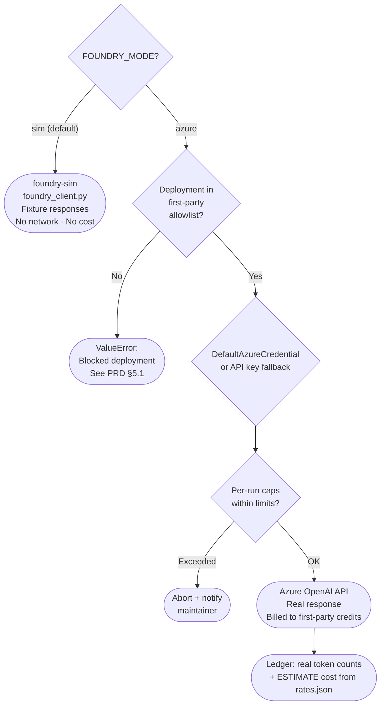
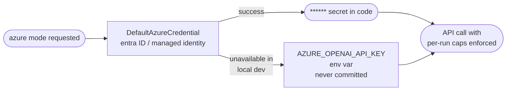

# PRD — Azure AI Foundry Integration

**Status:** Implemented (v1 live 2026-07-12) · **Owner:** CurationsX · **Scope:** Real Azure AI Foundry integration design — **explicitly gated behind the `foundry-sim` local emulator**

> ✅ **This integration is now LIVE (2026-07-12).** `FOUNDRY_MODE=azure` calls a real Azure OpenAI deployment (`gpt-5.4-mini` on `yolo-foundry`, eastus2), guarded by the Tier 1 allowlist, per-run caps, and a git-ignored azure ledger. The local offline simulator (`foundry-sim/`) remains the default mode (`FOUNDRY_MODE=sim`) and the only mode CI runs.

> **Product authority:** This infrastructure and spend-control PRD is
> subordinate to
> [`PRD-project-evidence-registry.md`](PRD-project-evidence-registry.md).
> Foundry provides optional guidance; it does not establish Project evidence.

## 1. Purpose

Document the design for connecting the CurationsX YOLO repository to Azure AI Foundry using first-party Azure OpenAI deployments, with guardrails that keep all spend within Microsoft for Startups (Founders Hub) credit terms. Establish the `FOUNDRY_MODE=sim|azure` seam so switching from the emulator to the real client is a configuration change, not a code rewrite.

## 2. Background

The `foundry-sim/` package provides a local, zero-cost emulation of Azure AI Foundry behavior (see `foundry-sim/README.md`). Before any real Azure keys are connected, the maintainer uses the simulator to see the visuals, build personas and workflows, and judge ROI.

When the sim stage is validated, the real integration follows the same `FoundryClient` interface — same `client.chat(messages)` call, same response shape — with `FOUNDRY_MODE=azure` and the Azure env vars set.

### Startup Credits guardrails

Microsoft for Startups (Founders Hub) Azure credits have a critical limitation that directly shapes this design:

| Spend type | Covered by Azure Startup Credits? |
| --- | --- |
| Azure OpenAI models (GPT-4o, GPT-4o mini, GPT-4 Turbo, etc.) | ✅ Yes — first-party Azure services |
| Third-party / Marketplace models in Foundry (e.g., Anthropic Claude, Fireworks, Llama via Marketplace) | ❌ No — billed directly to card even when credits exist |
| GitHub Actions / Codespaces / metered billing | ❌ No — separate GitHub billing bucket |

**This integration is restricted to first-party Azure OpenAI deployments only.** Third-party and Marketplace model IDs are blocked by an explicit allowlist. This is not a preference — it is a hard guardrail to prevent unexpected charges against your payment method.

## 3. Goals

1. **Define the real Azure integration design** so it is ready to implement when the sim stage is validated.
2. **Specify auth** — Entra ID (`DefaultAzureCredential`) as default, API key as local-dev fallback only.
3. **Document the first-party-only allowlist** that blocks third-party / Marketplace model IDs.
4. **Specify budget alerts and per-run caps** that enforce the bounded-spend principle.
5. **Keep the `FOUNDRY_MODE` seam clean** — same client interface, config change only.

## 4. Non-Goals

- Enabling `FOUNDRY_MODE=azure` in this build.
- Using third-party or Marketplace models (Claude, Fireworks, Llama via Marketplace, etc.).
- Committing secrets, keys, or endpoints to the repository.
- Replacing the sim emulator as the default mode.
- Capturing or showcasing agent session logs.

## 5. Startup Credits Guardrails

### 5.1 First-party model allowlist

Only first-party Azure OpenAI deployment name patterns are permitted, in two tiers. Any deployment name not on either list must be rejected before a request is made:

```python
# Tier 1 — approved for the initial integration (per §5.4 maintainer approval):
# OpenAI-family mini/small tiers on Standard pay-as-you-go billing only.
FIRST_PARTY_ALLOWED_PREFIXES = [
    "gpt-5.4-mini",            # ✅ deployed: yolo-foundry / eastus2 / version 2026-03-17 / GlobalStandard
    "gpt-5-mini",
    "gpt-4.1-mini",
    "gpt-4o-mini",
    "text-embedding-3-small",
]

# Tier 2 — first-party but NOT approved for this integration without explicit
# maintainer sign-off (full-size / specialty models):
FIRST_PARTY_APPROVAL_REQUIRED_PREFIXES = [
    "gpt-5", "gpt-4o", "gpt-4-turbo", "gpt-4", "gpt-35-turbo",
    "text-embedding-3-large", "text-embedding-ada",
    "dall-e", "whisper", "tts",
]
```

Rejection behavior: raise `ValueError` with a message that names the disallowed deployment and links to this PRD. Tier 2 names raise with a distinct message stating that maintainer approval is required.

> **Maintenance note:** Model generations move faster than this document. Subscription billing meters already show GPT-5.5-era models in use elsewhere in the org (verified 2026-07-12). Refresh both lists against the live Azure OpenAI model catalog as an explicit step in M3 — do not provision from this list blindly.

### 5.2 Per-run token and request caps

| Cap | Default | Enforcement |
| --- | --- | --- |
| Max output tokens / request | 4,096 | Set in API call parameters; hard cap |
| Max requests / run | 50 | Enforced in client; raise after limit |
| Max estimated cost / run | USD 1.00 | Computed from `rates.json`; abort if exceeded |
| Request timeout | 30 s | `httpx` timeout parameter |

### 5.3 Budget alerts

Set the following Azure Cost Management alerts in the Azure portal for the subscription:
- 80% of monthly credit budget → email alert to maintainer.
- 100% of monthly credit budget → email alert to maintainer + block further spend.

These alerts are a manual setup step in the Azure portal; they are not configured by code in this repository.

> **Important:** Azure budgets generate *notifications only* — they do not automatically stop or deallocate resources. Treat every budget as an alarm, not a circuit breaker. Any "block further spend" behavior requires an explicit action group / automation, which must be designed and approved separately.

### 5.4 Billing model — pay-as-you-go only (hard rule)

The Azure Foundry integration MUST use **Standard (pay-as-you-go) token-based billing only**.

- **Never** provision PTU (Provisioned Throughput Units), reserved capacity, or any pre-paid monthly package. These bill continuously regardless of usage — a prior accidental provisioned-capacity dependency cost roughly **USD 499/day** with zero usage.
- Prefer the most cost-effective standard token option available for the required model (e.g., Global Standard deployment of a small/mini model tier).
- Any deployment SKU other than Standard requires explicit written approval from the maintainer before creation.

**Maintainer approval (2026-07-12):** Azure AI Foundry is approved as the future host for the real integration, under these conditions:

- Spend draws on the **Microsoft for Startups credits** on the existing subscription.
- Models are **OpenAI-family mini/small tiers** (e.g., a `*-mini` deployment) on Standard pay-as-you-go token billing.
- All rules in this section (no PTU, no pre-paid) continue to apply.

### 5.5 Billing separation note

GitHub metered billing (Actions, Codespaces, Copilot) is billed separately from Azure credits. Do not assume Azure credits offset GitHub charges. Monitor both billing buckets independently.

> Verified 2026-07-12: GitHub metered charges route through the same Azure subscription and dominate its bill (~$4,460 of ~$4,772 MTD). Cost reviews must separate the `GitHub` service line from actual Azure service spend before drawing conclusions.

### 5.6 Cost attribution — dedicated resource group and scoped budget

The subscription hosting this integration **already carries unrelated Foundry Models spend** from other agent workloads (verified 2026-07-12: $252 MTD, spiking $60–88/day). A subscription-level budget cannot attribute which workload is spending. Therefore:

- **Dedicated resource group:** all resources for this integration live in `rg-yolo-foundry` (no shared resource groups).
- **Tags** on every resource: `project=yolo`, `component=foundry-integration`, `owner=curationsx`.
- **Scoped budget** on `rg-yolo-foundry` created at M3, before the first deployment:
  - Proposed initial amount: **USD 50/month** — *maintainer to confirm before creation.*
  - Alerts at 50% / 80% / 100% actual **plus a 100% forecast alert**.
  - Alert recipient: the maintainer email already configured on the subscription's `curations-cost-guardrail` budget.
- This project's spend must never be inferred from subscription totals; use the resource-group scope.

### 5.7 Cost levers (informed by observed billing meters)

Observed GPT-5.5-era token meters (2026-07-12) show where real money goes. Apply these levers in order of impact:

1. **Context discipline.** Long-context ("LongCo") meters bill at a higher rate than short-context ("ShortCo") and dominated observed spend. Keep prompts below the long-context threshold whenever possible.
2. **Prompt caching.** Cached-input meters were the single largest observed line item — caching discounts repeated context, but agents that resend huge contexts still pay heavily. Design prompts for cache hits *and* smaller contexts, not caching as an excuse for bloat.
3. **Mini tier by default** (§5.4). Escalating to a Tier 2 model is a maintainer decision, not a convenience.
4. **Output caps** (§5.2) — output tokens are the most expensive meter class per token.

### 5.8 Spend anomaly runbook

Azure budgets alert but do not stop spend (§5.3). If spend looks wrong, act in this order:

**1. Check month-to-date spend by service (read-only, safe anytime):**

```bash
az rest --method POST \
  --url "https://management.azure.com/subscriptions/$(az account show --query id -o tsv)/providers/Microsoft.CostManagement/query?api-version=2023-11-01" \
  --body '{"type":"ActualCost","timeframe":"MonthToDate","dataset":{"granularity":"None","aggregation":{"totalCost":{"name":"Cost","function":"Sum"}},"grouping":[{"type":"Dimension","name":"ServiceName"}]}}'
```

**2. Kill switch — delete the deployment.** Deleting a Standard (pay-as-you-go) deployment halts all token billing immediately. Deployments are stateless configuration; recreating one later is a config change, not data loss.

```bash
az cognitiveservices account deployment delete \
  --name <foundry-resource-name> \
  --resource-group rg-yolo-foundry \
  --deployment-name <deployment-name>
```

**3. If billing continues after deployment deletion,** the charge is not token usage — check for provisioned/PTU resources (§5.4 violation), and delete the offending resource, not just the deployment.

Trigger threshold: any day where `rg-yolo-foundry` spend exceeds ~3× the recent daily average without a known cause. When in doubt, kill first, investigate second — recreation is cheap.

## 6. Functional Requirements

### 6.1 Authentication

Auth follows this priority order:

1. **Entra ID — `DefaultAzureCredential`** (default, recommended for production).
   - Uses managed identity, workload identity, or developer credentials automatically.
   - No secret in code or environment. Rotates automatically.
   - Set `AZURE_CLIENT_ID` if using a user-assigned managed identity.

2. **API key — local development fallback only.**
   - Read from `AZURE_OPENAI_API_KEY` environment variable.
   - Never committed to the repository.
   - Used only when `DefaultAzureCredential` is unavailable (local dev without managed identity).

### 6.2 Configuration (environment variables only)

All configuration is via environment variables. No values are committed to the repository. See `.env.example` for the list of variable names.

| Variable | Required | Description |
| --- | --- | --- |
| `FOUNDRY_MODE` | Yes | `sim` (default) or `azure`. Must be explicitly set to `azure` to enable. |
| `SIM_PROFILE` | No | Persona hint for sim mode. Default: `auto`. |
| `AZURE_OPENAI_ENDPOINT` | azure mode | Full endpoint URL, e.g. `https://<resource>.openai.azure.com/` |
| `AZURE_OPENAI_DEPLOYMENT` | azure mode | Deployment name (checked against first-party allowlist) |
| `AZURE_OPENAI_API_VERSION` | azure mode | API version, e.g. `2024-02-01` |
| `AZURE_CLIENT_ID` | No | Client ID for user-assigned managed identity (Entra ID) |
| `AZURE_OPENAI_API_KEY` | No | Local-dev fallback only. Prefer `DefaultAzureCredential`. |

### 6.3 Python dependencies (future real integration)

The following dependencies belong to the real Azure integration and are **not installed or required by the sim**. They should be captured as an optional dependency set in `automation/pyproject.toml` when the real integration is built:

```toml
[project.optional-dependencies]
azure = [
    "openai>=1.30",
    "azure-identity>=1.17",
    "httpx>=0.27",
    "pydantic>=2.7",
]
```

The `foundry-sim/` simulator and all current tooling remain standard-library-only.

### 6.4 Client interface (unchanged from sim)

The real Azure client must implement the same interface as `FoundryClient`:
- `client.chat(messages, *, fixture_id=None, record_to_ledger=True)` → response dict
- `client.complete(prompt, ...)` → response dict
- `client.list_fixtures()` → list (returns empty in azure mode)
- `client.get_ledger()` → ledger dict

Switching from sim to azure is `FOUNDRY_MODE=azure` — no changes to personas, workflows, or calling code.

### 6.5 Ledger separation in azure mode

`foundry-sim/ledger.json` is a **tracked file**, and CI enforces that `install.sh` leaves the checkout clean (`.github/workflows/foundry-sim.yml`). Real-mode runs must therefore never write to the tracked ledger:

- Azure mode writes to `foundry-sim/ledger.azure.json` (or an `FOUNDRY_LEDGER_PATH` override).
- That file is git-ignored — add it to `.gitignore` in the same PR that implements azure mode.
- Real ledger entries record **actual token counts** from API responses; cost figures remain labeled ESTIMATE (computed from `rates.json`, which is not a billing source of truth).
- The tracked `ledger.json` stays reserved for local sim/demo use.

### 6.6 CI policy — no Azure credentials in GitHub Actions

- The CI workflow (`.github/workflows/foundry-sim.yml`) runs sim mode only and must never receive Azure credentials, endpoints, or subscription identifiers.
- If a future integration test stage needs real Azure access, it uses **Workload Identity Federation (OIDC)** via `azure/login` with a federated credential — never a long-lived client secret stored in GitHub.
- Any such stage must be a separate, manually-triggered workflow (`workflow_dispatch`) with its own approval environment — never part of the default PR path.

## 7. Mermaid: Sim / Azure seam



## 8. Mermaid: Auth flow



## 9. `.env.example`

See `.env.example` in the repository root. That file lists variable names only — no values, no secrets. Add actual values to your local `.env` file (git-ignored) or to GitHub Actions secrets.

## 10. Success Criteria

- `FOUNDRY_MODE=azure` raises a clear error in the current build (implemented).
- `FOUNDRY_MODE=sim` (default) runs fully offline with no network calls (implemented).
- When the real integration is built: all requests go through the first-party allowlist check; no third-party model can be invoked.
- Budget alerts set in Azure portal; per-run caps enforced in code.
- No secrets committed; `tools/yolo.py doctor` passes unchanged.

## 11. Open Questions

Resolved 2026-07-12 (recon + maintainer direction):

- ~~Should Workload Identity Federation be configured for CI/CD?~~ **Yes — OIDC only, no client secrets** (§6.6). `DefaultAzureCredential` remains the production path.
- ~~What is the initial monthly token budget cap?~~ **Proposed USD 50/month scoped to `rg-yolo-foundry`** (§5.6); maintainer confirms the amount at M3.
- ~~Which models?~~ **Mini-tier only at launch** (§5.1 Tier 1, §5.4 approval).

Still open:

- Which Azure region will host the OpenAI deployment (affects latency, data residency, and mini-tier model availability)?
- Which API version (`AZURE_OPENAI_API_VERSION`) will be locked at first deployment?
- ~~Exact current-generation mini deployment name~~ **Resolved: `gpt-5.4-mini` version 2026-03-17 (eastus2, GlobalStandard).**
- Remaining Microsoft for Startups credit balance and expiration date (check in Founders Hub portal before M3 — determines how much runway the credits actually provide).

## 12. Milestones

1. **M1 — Sim validated:** ✅ Done (2026-07-12). Emulator runs fully offline; 22/22 tests pass across Python 3.9–3.14 in CI (`.github/workflows/foundry-sim.yml`); dashboard shows correct topology and ESTIMATE cost.
2. **M2 — Design approved:** ✅ Done (2026-07-12). Maintainer approved Foundry as host under §5.4 conditions (Startups credits, mini tier, PAYG only).
3. **M3 — Azure provisioning:** ✅ Done (2026-07-12). `rg-yolo-foundry` created in eastus2 with tags; `yolo-foundry` AIServices resource (S0); `gpt-5.4-mini` deployment (version 2026-03-17, GlobalStandard PAYG); scoped budget `yolo-foundry-50-monthly` USD 50/month with 50/80/100% actual + 100% forecast alerts (§5.6). Startups credit balance/expiry still needs a manual Founders Hub portal check (not queryable via CLI).
4. **M4 — Auth configured:** ✅ Done (2026-07-12). Entra bearer token via `az` CLI verified against the live deployment; API key fallback documented in `.env.example`; no credentials in CI (§6.6).
5. **M5 — Integration tested:** ✅ Done (2026-07-12). Real chat completion succeeded against `gpt-5.4-mini` (28 tokens, correct response); allowlist + per-run caps enforced in `foundry_client.py` with offline guard tests; azure ledger (`ledger.azure.json`, git-ignored) recorded the real run with actual token counts (§6.5).
6. **M6 — Community pilot:** First real agent invocation under the protocol in `docs/PRD-aot-agent-protocol.md`.
