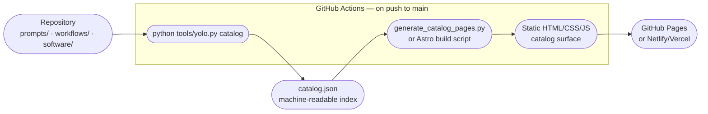

# PRD — Catalog Surface

**Status:** Draft · **Owner:** CurationsX · **Scope:** A browsable catalog surface generated from `catalog.json` for discovery without cloning

## 1. Purpose

Build a static, generated catalog surface that lets anyone browse prompts, workflows, and software entries from `catalog.json` without cloning the repository — so the CurationsX YOLO artifact library is discoverable on the web with search, filtering, and linking to source files.

## 2. Background

`catalog.json` is generated by `python tools/yolo.py catalog` and contains a stable, machine-readable index of all prompts, workflows, and software entries with their metadata. This is a **Later** roadmap item ("A published catalog surface generated from `catalog.json` for browsing without cloning").

The repository currently has 8 prompts, 5 workflows, and 12 software entries. A static catalog surface would surface these to practitioners who land via search or social sharing without requiring Git knowledge.

## 3. Goals

1. **Generate a browsable catalog** from `catalog.json` — no manual HTML authoring, no CMS.
2. **Full-text search** over prompt/workflow titles, categories, and purposes.
3. **Filter by category and kind** (prompt / workflow / software).
4. **Deep linking** to individual artifact pages that link to the source Markdown file in the repository.
5. **Zero runtime cost** — static site, deployable to GitHub Pages, Netlify, or Vercel free tiers.
6. **Auto-update** — regenerate on every push to `main` via GitHub Actions.

## 4. Non-Goals

- A content management system or database.
- User accounts, authentication, or personalization.
- Editing artifacts from the catalog surface (changes go through PRs to the repository).
- Telemetry, tracking, or analytics.
- Replacing the CLI (`tools/yolo.py`) or the Git-based workflow.

## 5. Guiding Principles

| Principle | Meaning |
| --- | --- |
| Generated, not written | The catalog surface is derived from `catalog.json`; the source of truth remains the repository. |
| Portable | Output is static HTML/CSS/JS deployable anywhere with no server. |
| Honest | Every page links back to the source file; no content is paraphrased or rewritten. |
| Lightweight | No tracking scripts, no CDN dependencies that could disappear, no large JS bundles. |

## 6. Functional Requirements

### 6.1 Technology choice

**Recommended: MkDocs Material** (Python, well-suited to documentation sites, native GitHub Pages support, full-text search built in).

Alternative: **Astro** (JavaScript, faster build for larger catalogs, component-based) — preferred if the catalog grows beyond ~200 entries or if an interactive filtering UI is needed.

Decision: defer to maintainer preference. Both options are documented below.

### 6.2 MkDocs Material approach

```yaml
# docs-catalog/mkdocs.yml (example, not generated yet)
site_name: CurationsX YOLO Catalog
theme:
  name: material
  features:
    - search.suggest
    - search.highlight
    - navigation.tabs
plugins:
  - search
  - gen-files:
      scripts:
        - generate_catalog_pages.py   # reads catalog.json, writes .md pages
```

A `generate_catalog_pages.py` script reads `catalog.json` and writes one Markdown page per artifact. The script is run as part of the MkDocs build.

Dependencies (separate from `tools/yolo.py` — never pollute the stdlib-only CLI):

```toml
# automation/pyproject.toml [docs] optional group
[project.optional-dependencies]
docs = [
    "mkdocs-material>=9.5",
    "mkdocs-gen-files>=0.5",
]
```

### 6.3 Astro approach

An Astro project in `catalog-site/` reads `catalog.json` at build time and generates static pages with client-side filtering. Smaller JS footprint than a React SPA; no server required.

### 6.4 Catalog page structure

Each artifact page must include:
- Title and category.
- Purpose / description.
- Link to the source file in the repository.
- Metadata fields from the artifact's frontmatter.
- A "How to use" note pointing to the CLI (`python tools/yolo.py show <id>`).

### 6.5 Mermaid: Catalog generation pipeline



### 6.6 GitHub Actions workflow

A workflow at `.github/workflows/catalog.yml` should:
1. Run `python tools/yolo.py doctor` (validates all artifacts).
2. Run `python tools/yolo.py catalog` (regenerates `catalog.json`).
3. Build the catalog site (MkDocs or Astro).
4. Deploy to GitHub Pages (or a configured static host).

### 6.7 Search

MkDocs Material ships full-text search with no additional configuration. Astro requires a client-side search library (e.g., Fuse.js — ~24 KB, no tracking).

## 7. Success Criteria

- `catalog.json` is regenerated automatically on every push to `main`.
- A publicly accessible catalog URL is published in the README.
- All 8 prompts, 5 workflows, and 12 software entries (and future additions) are browsable and linkable.
- Full-text search returns relevant results within one second.
- The CLI (`tools/yolo.py`) is unmodified; the catalog surface is a read layer, not a replacement.

## 8. Open Questions

- MkDocs Material or Astro — which does the maintainer prefer?
- Where should the catalog be deployed — GitHub Pages (`curationsx.github.io/yolo`) or a custom domain?
- Should the catalog include a changelog of artifact revisions, or only current state?
- How should draft artifacts be handled — included with a `[DRAFT]` label, or excluded?

## 9. Milestones

1. **M1 — Decision:** Choose MkDocs Material or Astro; document in `automation/pyproject.toml` as an optional dep group.
2. **M2 — Generator script:** Write `generate_catalog_pages.py` (or Astro data loader) that reads `catalog.json` and produces one page per artifact.
3. **M3 — Local preview:** Run `mkdocs serve` (or `astro dev`) locally and confirm all artifacts render correctly.
4. **M4 — CI pipeline:** GitHub Actions workflow that regenerates `catalog.json` and deploys the catalog on push to `main`.
5. **M5 — Published:** Catalog URL live; linked from README.
