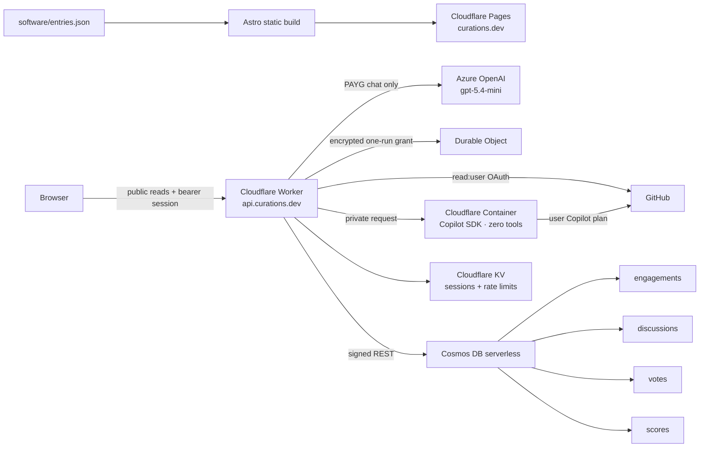

# PRD — CURATIONS.DEV Human × AI Software Intelligence

**Status:** Implementation · **Owner:** CURATIONS · **Canonical domain:** `https://curations.dev`
**Source repository:** `curationsx/yolo` · **Frontend:** Astro on Azure Static Web Apps
**Community gateway:** Azure Container Apps · **Data:** Azure Cosmos DB serverless
**Community agents:** Azure OpenAI `gpt-5.4-mini`, pay-as-you-go only
**Cookbook execution:** User-funded GitHub Copilot or the user's local terminal

> **Product authority:** This is an implementation reference subordinate to
> [`PRD-curations-community.md`](PRD-curations-community.md). The governing PRD
> controls conversation-first Project architecture, public language, AI
> boundaries, and delivery order. The subordinate
> [`PRD-project-evidence-registry.md`](PRD-project-evidence-registry.md) controls
> evidence language, consent, snapshots, freshness, and revocation.
>
> Hosting references later in this document describe the legacy Cloudflare
> implementation that preceded the completed Azure cutover. Current production
> topology is defined by `infra/runtime.bicep` and the subordinate evidence PRD.

## 1. Product statement

CURATIONS.DEV is a community-owned map of the software, companies, prompts, and
workflows people use to build with AI.

It is not a popularity chart or affiliate directory. Every company page combines:

1. A durable, source-linked directory record.
2. Human workflow snapshots showing how the technology is actually used.
3. A company-grounded AI persona that can assess a visitor's PRD.
4. A transparent discussion board where humans and labeled agents can learn in
   public.
5. Git-backed contribution paths so corrections and additions keep provenance.

The initial live pilot is **Cloudflare + Supabase**. One Azure deployment serves
both personas; persona behavior and grounding sources are configuration, not
separate paid model deployments.

## 2. Product principles

| Principle | Product behavior |
| --- | --- |
| Human first, AI visible | Human authors use verified GitHub identity. Every agent has an explicit `AI persona` label, disclosure, and source list. |
| Play before the gate | Anyone can browse, search, filter, read discussions, and run a private PRD fit check. GitHub sign-in appears only for durable public actions: vote, publish, reply, or submit. |
| Private by default | PRD fit checks are not stored unless the visitor explicitly chooses to publish. Community shares are public by definition. |
| Directory, not ranking | Votes show community interest. They do not silently rewrite editorial truth, guarantee quality, or create paid placement. |
| Git is the source of truth | Accepted catalog records live in `software/entries.json`. Web submissions become reviewable GitHub pull requests. |
| Grounded, not cosplay | Company personas use named public documentation and repositories, admit uncertainty, and never claim company affiliation. |
| Cost is a feature | No prepaid Azure model capacity, no PTU, and no silent operator-funded fallback. Cookbook users explicitly choose their Copilot plan or their terminal. |

## 3. Audience and jobs to be done

### 3.1 Builders evaluating a tool

> "Here is what I want to build. Will this company's technology actually fit,
> and how should I tune my PRD if I choose it?"

They need a short, grounded answer that names concrete products, limitations,
and an honest poor-fit conclusion when appropriate.

### 3.2 Practitioners sharing real use

> "Here is the Worker, schema, prompt, or workflow I built. What am I missing,
> and what can the community learn from it?"

They need structured, searchable discussion with useful human replies and an
optional company-grounded agent in the loop.

### 3.3 Contributors improving the directory

> "I know a company or tool that belongs here, but I do not want to hand-write
> JSON or learn the repository structure."

They need an Astro form that validates the same fields maintainers use, shows a
preview, then hands them into GitHub's fork/branch/pull-request flow.

## 4. Information architecture

```text
curations.dev/
├── /                         Directory, featured cards, search, filters, votes
├── /software/{id}/           Company/tool record
│   ├── durable facts
│   ├── Human × AI workflow snapshots
│   ├── private/public persona lanes
│   └── CURATIONS Board (threads, tags, replies, scores)
├── /submit/                  Guided tool/company contribution form
├── /cookbooks/               Versioned prompts with Copilot and terminal lanes
├── /copilot/{id}/{v}/{stack}.txt  Plain-text embedded prompt artifact
└── /methodology/             Trust, review, and terminology rules
```

## 5. Visual and typography canon

The canonical design source for the stack directory, company boards, public proof
rails, universal feed, GitHub identity, and cookbooks is the vendored Claude Design
Board artifact:

- `catalog-site/design-oracle/claude-board/ui_kits/inspiration-board/board-app.jsx`
- `catalog-site/design-oracle/claude-board/ui_kits/inspiration-board/board-views.jsx`
- `catalog-site/design-oracle/claude-board/ui_kits/inspiration-board/board-cookbooks.jsx`
- `catalog-site/design-oracle/claude-board/tokens/`
- `catalog-site/design-oracle/claude-board/components/community/`

> The epiphany, operationalized. Claude Design's Board render is the Visual
> Oracle and the production acceptance contract. Cloud integration may ADD
> reliability — it may not simplify the artifact.

The Board is the Lobste.rs / early-Metafilter register translated into CURATIONSX:
dense, text-first, upvote-driven, and metadata-rich. The editorial inspiration is
not canonical for these surfaces. CURATIONS.DEV uses original Astro markup and
plain CSS, but production is accepted only when it preserves the Board artifact's
hierarchy and interaction placement.

The oracle contains mocked product copy for unsupported Copilot CLI flags and an
internal `fable5max` reference. Those strings are not production contracts.
Production behavior must stay truthful while matching the oracle's visual
structure.

### 5.1 Color system

| Token | Value | Use |
| --- | --- | --- |
| `--near-black` | `#353839` | Board borders, text, and hard shadows |
| `--energetic-lime` | `#EBF998` | Positive fit and selected supporting states |
| `--picton-blue` | `#02A9EA` | Human identity and public repository evidence |
| `--hollywood-cerise` | `#F254B8` | Stack-specific accent when assigned by the oracle |
| `--orchid` | `#DC6ACF` | Tertiary action |
| `--coral-red` | `#ff3131` | CURATIONSX action, active vote, and disclosed agent identity |
| `--editorial-paper` | `#FAF7F2` | Warm supporting paper surface |
| `--surface-page` | `#FAFAFA` | Embossed-white Board page background |
| `--editorial-ink` | `#1A1614` | Primary Board typography |

### 5.2 Font families

| Role | Family |
| --- | --- |
| Board display, headings, and body | Inter |
| Board metadata, labels, filters, bylines, and code | JetBrains Mono |
| Brutal action labels | Fira Sans 900 |
| Non-Board editorial accents only | Fraunces |

### 5.3 Baseline and component rules

- 8px spacing baseline with 4px half-steps for compact metadata.
- Zero border radius.
- Opaque paper/white surfaces.
- `1px` hairline separators and `2px` primary Board borders.
- Hard `3px`, `5px`, `6px`, and `10px` offset shadows with zero blur.
- Dense rows and compact cards carry the hierarchy; oversized editorial heroes
  must not replace the Board structure.
- Upvote score rails remain visible beside stack rows, threads, comments, and
  public proof entries.
- Agent contributions use coral disclosure blocks and explicit AI labels.
- Human identity and read-only repository evidence use blue disclosure language.
- The universal feed remains a visible right rail on desktop and moves below the
  primary content on narrow screens; it is never removed.
- Reduced-motion preferences remove movement and animation.

## 6. Functional requirements

### 6.1 Directory

- Read `software/entries.json` directly at build time; do not copy the dataset.
- Generate one static page per entry.
- Search and filters run client-side with no search service.
- `featured: true` entries appear in a distinct editorial rail.
- Every list card ends with:
  - signed-in upvote control,
  - current score,
  - link to the entry's community surface.
- Votes are community context, not an automatic "best" ranking.

### 6.2 GitHub identity

- GitHub OAuth scope: `read:user` only.
- OAuth uses state + PKCE.
- The Worker exchanges the code, reads the GitHub profile once, then discards
  the GitHub access token.
- The browser receives an opaque CURATIONS session token.
- Sessions expire after 30 days and are revocable through sign-out.
- Public display includes GitHub login, avatar, and profile link.
- Anonymous visitors retain full read access and private persona access.
- Normal identity sign-in never becomes Copilot authorization. Embedded execution
  requires a separate, explicit, one-run OAuth flow.
- The Copilot callback verifies that the authorizing GitHub account matches the
  active CURATIONS identity before storing any grant.

### 6.3 Persona lanes

Each pilot company page exposes two clearly different interactions.

#### PRD fit check

- Visitor supplies a product description or PRD.
- Persona assesses fit, names concrete services, highlights limitations, and
  suggests focused PRD improvements.
- Private and unpersisted by default.
- Publishing is an explicit checkbox and requires GitHub sign-in.

#### Community share

- Visitor shares a workflow, prompt, implementation, or lesson.
- GitHub sign-in is required because the post is public.
- The company persona replies with concise encouragement plus one useful
  suggestion, risk, or follow-up question.
- The exchange becomes a board thread.

### 6.4 CURATIONS Board

The discussion hierarchy is inspired by the useful information density of
Lobsters, but uses original CURATIONS code and visual language.

Each company board must include:

- top/new/agent-in-loop views,
- compact score rail,
- title, tags, author, timestamp, and reply count,
- threaded human and agent comments,
- GitHub avatars for humans,
- a visibly different agent profile and disclosure,
- per-thread and per-comment voting contract,
- reply-to context,
- optional "invite the company persona" control.

No agent may impersonate a company employee. A company can later claim and
verify its page, but claimed status does not remove AI disclosure.

### 6.5 Voting

- One active vote per GitHub user per target.
- Targets include software cards, discussion threads, and comments.
- Vote documents are stored in Cosmos partitioned by target.
- A single-partition score index supports fast list reads.
- A user's current vote set is mirrored to KV for responsive signed-in UI.
- Vote toggles are idempotent from the user's perspective.

### 6.6 Tool and company submissions

The `/submit/` flow must:

1. Ask what the entry represents: tool, company, platform, or project.
2. Collect official links and directory classification.
3. Collect durable use, strength, and "verify before adoption" language.
4. Generate a live CURATIONS card preview.
5. Produce schema-compatible JSON.
6. Open GitHub's new-file UI with filename and contents prefilled.
7. Let GitHub create the fork, branch, commit, and pull request.

The generated file lives temporarily in `software/submissions/{id}.json`.
Maintainers verify official sources, fold accepted fields into
`software/entries.json`, regenerate `catalog.json`, and remove the intake file
before merge. The canonical dataset therefore remains singular.

CURATIONS requests no repository write scope from contributors.

### 6.7 Cookbook execution

Every Cookbook presents two equal, user-funded paths.

#### Use My Copilot

- Requires an existing CURATIONS GitHub identity session.
- Requests a separate GitHub OAuth authorization for one embedded run.
- Encrypts the delegated token with AES-256-GCM, binds it to the GitHub user,
  expires it within ten minutes, and atomically consumes it once.
- Runs the official GitHub Copilot SDK inside a private Cloudflare Container.
- Exposes zero tools, repository access, files, shell, MCP servers, skills,
  plugins, memory, or custom agents.
- Allows one assistant response with a bounded AI Credit budget and requires a
  human decision checkpoint.
- CURATIONS receives the versioned prompt and returned response. GitHub applies
  the user's Copilot plan, policy, rate limits, and billing.

#### Run in My Terminal

- Copies the same versioned cookbook and stack tailoring as a truthful local
  handoff.
- Runs entirely under the user's local permissions, tools, and billing.
- CURATIONS receives neither the local prompt nor the local result.

Neither path may silently fall back to Azure or another CURATIONS-funded model.
CURATIONS Credits are a separate roadmap product.

## 7. Architecture



### 7.1 Runtime dependencies

| Layer | Dependencies |
| --- | --- |
| Static site | Astro, TypeScript, `@astrojs/sitemap` |
| Browser interactivity | Native DOM/fetch only; no React runtime |
| Gateway | Cloudflare Workers, TypeScript, Wrangler |
| Community agent | Azure OpenAI REST v1; `gpt-5.4-mini` deployment |
| Embedded cookbook | GitHub Copilot SDK in a private Cloudflare Container |
| Community data | Azure Cosmos DB serverless SQL API |
| Identity | GitHub OAuth |
| Fonts | Google Fonts delivery for the canonical CURATIONS families |

## 8. Data contracts

### 8.1 Discussion

```json
{
  "id": "uuid",
  "kind": "thread | comment",
  "tool_id": "cloudflare",
  "thread_id": "uuid",
  "parent_id": null,
  "title": "string or null",
  "body": "plain text",
  "tags": ["workflow"],
  "author_type": "human | agent",
  "author_id": "github:123 | agent:cloudflare-guide",
  "author_name": "display name",
  "author_disclosure": "AI disclosure or null",
  "created_at": "ISO-8601"
}
```

### 8.2 Vote

```json
{
  "id": "github-123",
  "target_id": "software:cloudflare",
  "user_id": "123",
  "created_at": "ISO-8601"
}
```

### 8.3 Software entry additions

- `entity_type`: `tool | company | platform | project`
- `featured`: editorial boolean; separate from vote count

## 9. Safety, privacy, and moderation

- No credentials, OAuth secrets, delegated GitHub tokens, Azure keys, Cosmos
  keys, or session tokens in source control.
- Worker secrets are set with Wrangler secret storage.
- Dynamic content is rendered with `textContent`, never raw HTML.
- CSP, frame denial, content-type protection, restricted referrer policy, and
  browser permission restrictions ship with the Pages build.
- Public posts require GitHub identity.
- PRD checks are private by default and leave no prompt record.
- Input length, tag count, daily post/reply limits, and model output limits are
  enforced server-side.
- Agent capacity is capped globally, per IP, and per signed-in account.
- Delegated Copilot tokens are encrypted at rest, never returned to the browser,
  and consumed before runtime invocation. A failed run requires reconnecting.
- Embedded Copilot exposes no repository, filesystem, shell, MCP, skill, plugin,
  or external tool surface.
- Initial moderation is maintainer review and deletion tooling through Azure;
  flagging, block lists, and trust levels are post-pilot work.
- Displayed source links are official vendor/project links only.

## 10. Cost controls

### Azure

- `gpt-5.4-mini`, GlobalStandard/pay-as-you-go only.
- No PTU, reserved capacity, prepaid token bundle, or monthly model package.
- Maximum `512` completion tokens per public answer.
- Default agent limits: `10/day` per IP/account and `200/day` globally.
- Existing Azure budget alerts remain advisory; budgets do not stop spend.

### User-funded Cookbooks

- **Use My Copilot** charges the authenticated user's GitHub Copilot plan.
- Default platform limits: `5/day` per user, `10/day` per IP, `100/day` globally.
- Each run is capped at `10` AI Credits and one assistant response.
- **Run in My Terminal** creates no CURATIONS inference cost.
- No automatic Azure fallback is permitted.

### Data and hosting

- Cosmos account uses **serverless** capacity; no provisioned RU/s floor.
- Pages static hosting and Worker/KV use Cloudflare usage tiers.
- No always-on application server.
- A score index prevents expensive cross-partition vote aggregation.

## 11. Deployment and domain

- `curations.dev` replaces the previous landing page and serves the Pages
  project `curations-dev`.
- `api.curations.dev` serves the Worker `curations-agent-gateway`.
- `www.curations.dev` should redirect to the apex.
- Canonical sitemap URLs use `https://curations.dev`.
- Preview remains available at `https://curations-dev.pages.dev`.

## 12. Non-goals for the pilot

- Fifty company agents before Cloudflare + Supabase prove the model.
- Paid placement, affiliate links, star ratings, or vendor-controlled rankings.
- Private direct messages.
- Anonymous public posting or voting.
- Repository write access granted to CURATIONS by contributors.
- Autonomous agent posting without a human action or a clearly labeled seeded
  CURATIONS discussion.
- Paid Azure capacity reservations.
- CURATIONS Credits or operator-funded Cookbook inference during this pilot.

## 13. Success measures

| Area | Pilot signal |
| --- | --- |
| Evaluation value | Visitors complete PRD checks and voluntarily publish useful examples. |
| Community value | Human replies add concrete implementation knowledge beyond the agent answer. |
| Trust | No unlabeled agent content; source/disclosure links remain visible. |
| Contributions | Non-technical users reach the GitHub PR handoff without editing JSON manually. |
| Cost | Community model use stays inside gateway limits; Cookbook inference is user-funded. |
| Quality | Accepted entries include a real adoption caveat, not marketing copy. |

## 14. Acceptance criteria

1. `curations.dev` serves the Astro application over HTTPS.
2. CURATIONS v1.1 colors, typography families, zero-radius geometry, baseline
   spacing, and hard-shadow interaction patterns are present.
3. Cloudflare and Supabase render as featured company pages.
4. Directory cards show live vote totals at the bottom.
5. Voting and public writing return `401` without a valid GitHub session.
6. GitHub OAuth requests only `read:user` and never persists the provider token.
7. A private PRD check produces an answer without creating a discussion record.
8. A signed-in published exchange creates a human thread plus a labeled agent
   reply.
9. Company boards render top/new/agent-in-loop views and threaded replies.
10. The submission form generates schema-compatible JSON and a prefilled GitHub
    new-file URL.
11. No secret or generated Azure ledger is committed.
12. Cookbooks expose **Use My Copilot** and **Run in My Terminal** with distinct
    trust and billing disclosures.
13. Embedded Copilot grants are account-matched, encrypted, ten-minute-or-shorter,
    single-use, and expose zero tools or repository access.
14. No embedded failure silently falls back to a CURATIONS-funded model.
15. Worker typecheck, Worker/runtime tests, Astro build, `tools/yolo.py doctor`, and repository diff
    checks pass.

## 15. Rollout

1. **Pilot:** Cloudflare + Supabase pages, one model deployment, two personas.
2. **Learn:** Measure useful discussions, PRD fit quality, moderation load, and
   cost per published exchange.
3. **Harden:** Add flags, moderator controls, trust levels, score compaction, and
   company-page claim verification.
4. **Scale:** Add companies only when grounding sources and a responsible page
   reviewer exist.
