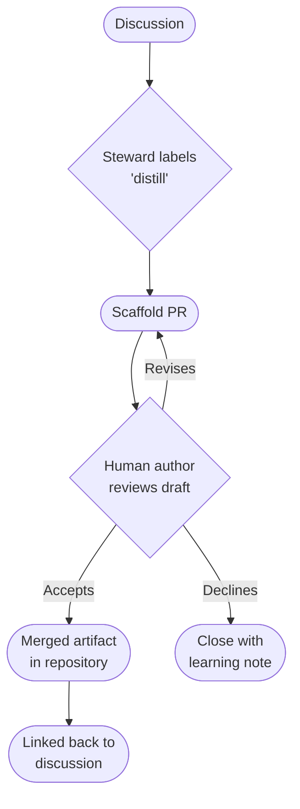
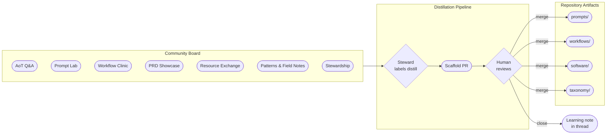

# PRD — Community Discussion Board

**Status:** Draft · **Owner:** CurationsX · **Scope:** GitHub Discussions activation, forms, distillation pipeline, and moderation

## 1. Purpose

Activate the Community Grid specified in `community/README.md` as a functioning GitHub Discussions board: eight categories with exact slugs, structured discussion forms, a discussion-to-artifact distillation pipeline, and a moderation compact — so community members can ask questions, expand prompts, review workflows, share PRDs and resources, and turn useful conversations into versioned repository artifacts.

## 2. Background

`community/README.md` fully specifies the board: eight categories, slugs, formats, forms, a collaboration loop, a compact, and an activation checklist. The four structured forms (`.github/DISCUSSION_TEMPLATE/prompt-lab.yml`, `workflow-clinic.yml`, `prd-showcase.yml`, `resource-exchange.yml`) now exist in the repository. GitHub Discussions has not yet been enabled for the repository; enabling it and creating the categories in repository settings is a one-step maintainer action.

The ROADMAP lists "Enable and manually exercise the Community Grid" as a **Next** milestone. This PRD drives that milestone to completion.

## 3. Goals

1. **Activate** GitHub Discussions with the eight blueprint categories and exact slugs.
2. **Wire discussion forms** so structured categories render required fields and reduce low-quality posts.
3. **Define a distillation pipeline** that converts high-value discussions into versioned repository artifacts (prompts, workflows, field notes, taxonomy changes).
4. **Document moderation and compact rules** so maintainers can apply them consistently without ad-hoc decisions.
5. **Establish a board-health CI check** that validates category slugs and form YAML against the blueprint so the durable contract cannot silently drift.

## 4. Non-Goals

- Building a custom discussion platform (GitHub Discussions is the board).
- Automating moderation decisions — a human steward reviews and acts.
- Capturing or showcasing agent session logs.
- Metrics dashboards or engagement scoring.
- Replacing the PR review process for code changes.

## 5. Guiding Principles

| Principle | Meaning |
| --- | --- |
| Human primacy | Every discussion closes with a human decision: merge, note-and-close, or escalate. |
| Transparency | AI involvement is declared; provenance is preserved in distilled artifacts. |
| Portable knowledge | Valuable outcomes live in Git, not locked to a discussion thread. |
| Compact as code | Moderation rules are documented, versioned, and publicly rationale-linked. |
| Minimum viable board | Activate exactly the categories in the blueprint; add more only with evidence of need. |

## 6. Functional Requirements

### 6.1 Category activation

A maintainer must create the following categories in **Settings → Discussions** with exact names and slugs. The forms activate automatically once slugs match the template file names.

| Section | Category name | Slug | Format | Form file |
| --- | --- | --- | --- | --- |
| Welcome | AoT Q&A | `aot-q-a` | Q&A | Freeform |
| Build | Prompt Lab | `prompt-lab` | Open-ended | `prompt-lab.yml` |
| Build | Workflow Clinic | `workflow-clinic` | Open-ended | `workflow-clinic.yml` |
| Showcase | PRD Showcase | `prd-showcase` | Open-ended | `prd-showcase.yml` |
| Discover | Resource Exchange | `resource-exchange` | Open-ended | `resource-exchange.yml` |
| Learn | Patterns & Field Notes | `patterns-field-notes` | Open-ended | Freeform |
| Govern | Stewardship | `stewardship` | Open-ended | Freeform |
| Project | Announcements | `announcements` | Announcement | Maintainers only |

### 6.2 Discussion forms

The four structured forms exist at `.github/DISCUSSION_TEMPLATE/`. Each enforces:
- A stated outcome or goal (required).
- Public-material confirmation checkbox (required).
- Provenance and AI-assistance disclosure (required).
- Opt-in review scope: human, agent, or both.
- For agent reviews: a depth selector (Focused / Standard / Deep) with a note that actual deployment limits apply.

### 6.3 Collaboration loop

Every discussion follows the seven-step loop documented in `community/README.md`:
Frame → Share → Invite → Examine → Human decides → Version → Report back.

The "Human decides" step is non-negotiable: no discussion closes by agent action alone.

### 6.4 Distillation pipeline

When a discussion produces a reusable artifact, a steward may propose distillation:

Distillation rules:
- The human author of the discussion must be credited in the artifact's frontmatter.
- Any material AI assistance in drafting the artifact must be disclosed.
- The resulting PR must link back to the source discussion.
- Closing without merging is valid; the steward records what was learned and why no change followed.

### 6.5 Moderation compact

The compact in `community/README.md` §Community compact governs all discussions. Maintainers apply it as follows:

| Situation | Maintainer action |
| --- | --- |
| Promotional drop or engagement farming | Hide post; note reason publicly (unless doing so amplifies harm). |
| Fabricated evidence or unsourced "best" claim | Request evidence; hide if not supplied within a reasonable window. |
| Secret, personal data, or confidential content | Hide immediately; contact poster privately. |
| Circular or bad-faith thread | Lock with public rationale. |
| Abusive participant | Restrict with public rationale. |

Significant moderation decisions include a public rationale unless publishing it would amplify harm or expose private information.

### 6.6 Activation checklist

The following steps must be completed before describing the board as **operational**:

- [ ] Enable GitHub Discussions for the repository (Settings → General → Features → Discussions).
- [ ] Create the eight categories with exact names and slugs from §6.1.
- [ ] Confirm each structured form renders and required fields enforce submission.
- [ ] Publish and pin a welcome discussion linking to `community/README.md`, `MANIFESTO.md`, and `docs/START-HERE.md`.
- [ ] Name initial human stewards and an escalation contact.
- [ ] Run privacy, accessibility, and abuse-case reviews.
- [ ] If an agent is deployed: publish its identity, permissions, model/provider disclosure, limits, and change log (see `docs/PRD-aot-agent-protocol.md`).
- [ ] Exercise each route manually before calling it operational.

### 6.7 Board-health CI

A GitHub Actions workflow should:
- Validate `.github/DISCUSSION_TEMPLATE/*.yml` files for required fields (`title`, `body` with at least one required field).
- Confirm category slugs in `community/README.md` match the template file names.
- Run `python tools/yolo.py doctor` on all pull requests.

## 7. Mermaid: Discussion → Artifact distillation pipeline

## 8. Success Criteria

- All eight categories exist with correct slugs; forms render and enforce required fields.
- Welcome discussion pinned and linking to orientation docs.
- Initial human stewards named.
- At least one discussion distilled into a versioned repository artifact under the pipeline.
- Privacy, accessibility, and abuse-case reviews completed.
- Board-health CI validates form YAML and slugs on each pull request.

## 9. Open Questions

- What is the initial moderation team size, and what is the escalation contact?
- Should the distillation action be a GitHub Actions workflow, a manual PR template, or both?
- How should the board handle discussions in languages other than English before a localization plan exists?

## 10. Milestones

1. **M1 — Activation:** Enable Discussions, create categories, confirm forms, pin welcome post, name stewards.
2. **M2 — First distillation:** Complete the first discussion-to-artifact pipeline end-to-end with a real community contribution.
3. **M3 — Board-health CI:** CI validates form YAML and slugs automatically on PRs.
4. **M4 — Accessibility review:** All discussion forms reviewed against an accessibility checklist.
