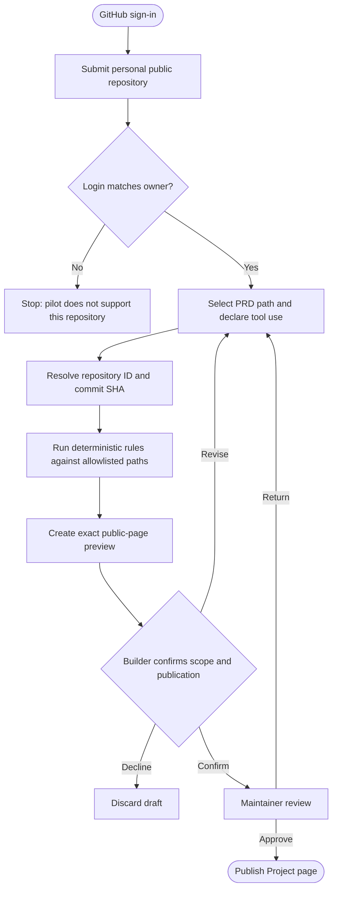
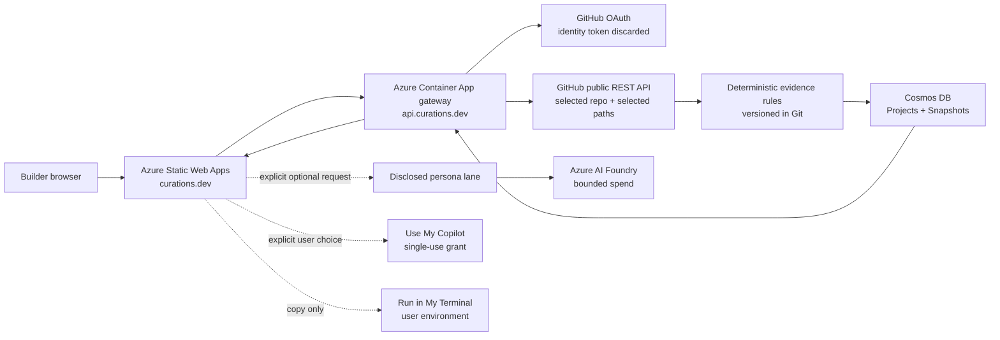

# PRD — CURATIONS.DEV Project Evidence Registry

**Status:** Approved trust-layer direction; implementation not started
**Owner:** CURATIONSX  
**Approved:** 2026-07-15  
**Canonical product:** `https://curations.dev`  
**Source repository:** `curationsx/yolo`

## 0. Authority

This is the subordinate GitHub intake and evidence trust-layer PRD for
CURATIONS.DEV.

[`PRD-curations-community.md`](PRD-curations-community.md) governs product
purpose, the canonical social object, community surfaces, onboarding, public
information architecture, and delivery order. This document governs repository
consent, deterministic observations, evidence language, snapshots, review,
freshness, and revocation. When the two conflict, the Community PRD controls the
product and this PRD controls only its trust-layer details.

The repository `AGENTS.md` and `MANIFESTO.md` continue to define safety and human
accountability. When a feature PRD or older implementation note conflicts with
this document, this document controls product purpose, public claims, scope, and
delivery order.

| Existing document | Relationship to this PRD |
| --- | --- |
| `docs/PRD-curations-community.md` | Governing CURATIONS.DEV product contract. |
| `docs/PRD-catalog-surface.md` | Current directory, identity, Board, persona, and Cookbook implementation reference. It must migrate toward the Project-centered model here. |
| `docs/PRD-community-discussion-board.md` | Optional contributor discussion and artifact-feedback surface. It is not the Project registry or its source of truth. |
| `docs/PRD-aot-agent-protocol.md` | Subordinate permission and disclosure contract for explicitly requested AI participation. |
| `docs/PRD-azure-foundry-integration.md` | Subordinate model-hosting and spend-control contract. It does not define verification. |

The copied Claude Design Board remains the Visual Oracle for layout, density,
typography, identity color, and interaction hierarchy. Its historical names and
mock copy are not product requirements and must not be surfaced merely because
they appear in the immutable reference package.

## 1. Trust-layer contract

> A builder voluntarily submits their own public repository and PRD. Curations
> publishes exactly what they declared and what was observed at a dated commit,
> then offers optional, human-controlled guidance.

Within this trust layer, the Project is the center. Evidence is the spine. AI is
a disclosed helper outside the evidence pipeline.

CURATIONS.DEV does not certify that a person uses a product in production. It
publishes narrow, inspectable facts about user-authorized public material.

## 2. Problem

Builders can find public repositories, software directories, community advice,
and reusable agent instructions in many separate places. What is missing is a
trustworthy connection among:

1. what a builder says they are building;
2. what their public PRD declares;
3. what a deterministic check can observe in their repository;
4. how they say each tool supports the project; and
5. which reviewed prompts or workflows may help next.

Self-reported stack lists offer context but little evidence. Automated scanners
can detect files and dependencies but cannot establish intent, production use,
quality, or fit. AI can explain findings but cannot turn either source into
proof of real-world usage.

The current implementation contains a useful repository-checking primitive, but
stores each submission as a discussion under one tool. Without a first-class
Project record and page, a multi-tool project cannot become the durable,
shareable center of the experience.

## 3. Audiences and jobs

### 3.1 Primary pilot audience: builders sharing their own work

> "I want to show what I am building, which tools I chose, why I chose them, and
> the exact public evidence supporting those statements."

They need an opt-in flow, precise public language, a preview before publication,
and a durable page they can revoke.

### 3.2 Secondary audience: builders researching approaches

> "Show me real, inspectable examples of projects that declared or exposed a
> signal for this tool, without pretending that a count means quality."

They need filters, exact source links, dates, caveats, and human explanations.

### 3.3 Maintainers

> "Let me review public submissions, correct overclaims, remove unsafe material,
> and improve deterministic checks without editing live records by hand."

They need a pending queue, rule versions, moderation actions, and a public
methodology.

### 3.4 Later audience: builders assembling a project Bookbag

> "Based on my declared and observed stack, show me reviewed, version-pinned
> instructions that I may choose to save or run with my own tools."

They need recommendations, not automatic installation or execution.

## 4. Goals

1. Make an opt-in public Project the canonical container for a submitted
   repository, PRD, tool claims, observations, and human explanation.
2. Publish only precise claims that a reader can inspect independently.
3. Separate declaration, observation, consent, review, and freshness instead of
   collapsing them into one "verified" badge.
4. Give each Project a permanent, shareable page and connect it to relevant tool
   pages without creating a popularity ranking.
5. Preserve the existing minimal GitHub identity and user-funded execution
   boundaries.
6. Earn later Cookbook and Bookbag recommendations from the Project evidence
   model rather than generic personalization.

## 5. Non-goals

- Proving production deployment, active subscriptions, business outcomes, or
  meaningful usage from a PRD, dependency, or configuration file.
- Crawling popular public repositories or sourcing projects that their builders
  did not submit.
- Supporting private repositories in the pilot.
- Requesting repository write access from a contributor.
- Ranking tools or projects as "best," "top," or most effective.
- Vendor endorsements, paid placement, affiliate links, or sponsored evidence.
- Allowing AI to establish, upgrade, or approve an evidence state.
- Giving hosted personas repository access, a shell, MCP, plugins, or unattended
  execution.
- Automatically installing, updating, activating, or running a skill.
- Building profiles, mentoring, peer attestations, or organization-repository
  support before the thin pilot passes.

## 6. Product invariants

1. **Explicit submission:** The builder chooses the repository and PRD. A public
   URL alone is never consent to crawl.
2. **Builder-controlled scope:** Only the named repository, PRD path, optional
   stack subdirectory, and versioned evidence-rule paths are fetched.
3. **Minimal identity:** Normal GitHub sign-in continues to request `read:user`,
   read the profile once, and discard the provider token.
4. **No repository write permission:** CURATIONS never asks to edit the submitted
   repository.
5. **Deterministic observations:** Repository observations come from versioned
   rules, not model inference.
6. **Point-in-time honesty:** A commit SHA and timestamp anchor an observation,
   but CURATIONS does not call an upstream GitHub link permanently immutable.
7. **AI stays separate:** The Project evidence pipeline makes no model call.
   Optional AI guidance is visibly separate and defaults off.
8. **Exact public preview:** A builder sees the claims, source links, excerpt,
   caveats, and labels exactly as they will appear before consenting to publish.
9. **Revocable participation:** The submitting builder can withdraw the public
   Project. Maintainers can hide unsafe or misleading material.
10. **No score laundering:** Counts and votes never convert declarations or file
    observations into editorial truth.
11. **Source-controlled behavior:** Evidence rules, schemas, labels, and
    deployment changes are reviewed in Git before production.

Whether the internal GitHub adapter uses direct REST calls or Octokit is an
implementation choice. It does not change these permissions or claims.

## 7. Evidence language

Evidence states are independent facts, not a linear trust score.

| Public label | Exact meaning |
| --- | --- |
| **GitHub identity confirmed** | The displayed GitHub account completed CURATIONS sign-in. |
| **Repository consent confirmed** | The pilot's ownership check established that the authenticated login matches the submitted personal repository owner. |
| **Declared in PRD** | The builder states that the named PRD describes this tool's role. This is self-reported context. |
| **Observed in repository** | A named, versioned deterministic rule matched a named file at the recorded commit. |
| **Human reviewed** | A named CURATIONS maintainer reviewed the displayed claim and source links. It is not a vendor endorsement or production audit. |
| **Fresh** | The source remained publicly available and the check completed within the configured freshness window. |
| **Stale** | The freshness window elapsed or a refresh could not reproduce the prior observation. |
| **Revoked** | The builder withdrew public participation or a maintainer removed the page from public view. |
| **Fork or template** | The submitted repository derives from another repository. This is always disclosed when supported after the pilot. |

### 7.1 Phase 1 public summary

Every Project page begins with a plain-language summary in this shape:

> Submitted by `@login` · repository consent confirmed · Cloudflare
> configuration observed at commit `abc1234` · use description declared by the
> builder · checked 12 days ago.

### 7.2 Prohibited public claims

The product must not publish:

- "verified user";
- "verified usage";
- "verified production stack";
- "this project runs on" when only a declaration or file signal exists;
- "best stack" or "top stack" derived from project count or votes; or
- a composite evidence score that hides which checks actually passed.

Preferred language names the literal fact:

> `wrangler.toml` matched the Wrangler configuration rule at commit `abc1234`.

## 8. Evidence subsystem: thin proof pilot

### 8.1 Scope

- Five invited builders.
- Personal, public GitHub repositories only.
- Authenticated GitHub login must equal the repository owner login.
- Repository must not be archived or a fork.
- One required Markdown PRD path inside the submitted repository.
- At least one declared Cloudflare or Supabase use case.
- Existing deterministic Cloudflare and Supabase marker families, revised to use
  commit SHAs and versioned rule identifiers.
- Manual maintainer review before publication.
- Thirty-day freshness window; refresh is explicit, not scheduled.
- No project ranking, public voting, Bookbag persistence, organization support,
  or AI-generated evidence commentary.

The existing private PRD fit check may remain available as a separate,
user-initiated feature. It is not part of Project verification and cannot change
Project evidence.

### 8.2 Smallest falsifiable proof

The model is disproved or must be redesigned if, after five real submissions:

1. a technically capable builder cannot complete submission in ten minutes;
2. an independent reader cannot understand and inspect every displayed claim in
   sixty seconds;
3. a planted configuration file is presented as anything stronger than the
   literal signal found;
4. a changed, deleted, or unavailable source remains displayed as fresh;
5. a Project can publish without owner match and explicit consent;
6. an agent runs without the builder explicitly requesting it; or
7. the builder cannot withdraw the public page without operator intervention.

## 9. Submission flow



### 9.1 Required steps

1. Authenticate with the existing GitHub identity flow.
2. Submit a `https://github.com/{owner}/{repo}` root URL.
3. Fetch public repository metadata and require:
   - `private === false`;
   - owner login equals the authenticated login;
   - `archived !== true`; and
   - `fork !== true`.
4. Record the stable numeric GitHub repository ID.
5. Resolve the default branch to its current commit SHA.
6. Select one Markdown PRD path within that repository and commit.
7. Collect a short builder-authored Project summary and, for each tool:
   - what the builder says it is used for;
   - where the relevant stack lives, if not at repository root; and
   - an optional short excerpt the builder approves for display.
8. Fetch only the PRD and rule-declared evidence paths at the resolved commit.
9. Record the PRD path, Git blob identity when available, SHA-256 content hash,
   and the deterministic observation results.
10. Render the exact public preview with declaration, observation, freshness,
    limitations, and source links separated.
11. Require an explicit publication confirmation tied to the preview version.
12. Place the draft in a maintainer review queue.
13. Publish only after approval.

The "invite persona" control is unchecked by default. Project submission itself
never implies agent consent.

## 10. Public information architecture

```text
curations.dev/
├── /                         Conversation-first Project feed + Community Pulse
├── /software/{id}/           Curated tool record
│   └── Projects              Declared and observed examples, never a ranking
├── /projects/                Opt-in public Project registry
│   └── /projects/{owner}/{repo}/
│       ├── builder-approved summary
│       ├── repository and PRD snapshot
│       ├── per-tool declarations
│       ├── deterministic observations
│       ├── freshness and limitations
│       └── optional guidance, visibly separate
├── /submit/                  Propose a tool for the curated directory
├── /submit/project/          Submit your own Project
├── /cookbooks/               Versioned, reviewed instruction artifacts
└── /methodology/             Evidence language, rules, and limitations
```

### 10.1 Project page hierarchy

1. Repository identity, submitter, status, checked date, and revocation state.
2. "What the builder says they are building" in human identity blue.
3. PRD path, commit, hash, and builder-approved excerpt.
4. Dense per-tool evidence rows:
   - declared use;
   - exact matched or unmatched checks;
   - rule version;
   - source path and commit link; and
   - literal limitation.
5. Optional human discussion.
6. Optional AI suggestions in a coral, explicitly labeled block after all
   evidence.

The Visual Oracle remains binding: dense rows, score/evidence rails, mono
metadata, zero-radius opaque surfaces, hairline separators, `2px` borders, hard
shadows, blue human identity, coral AI identity, and the desktop feed rail. The
Project experience must not become a generic card grid or editorial hero page.

## 11. Data contracts

The pilot deliberately uses three records: Project, Snapshot, and ToolClaim.
Bookbags, peer attestations, and organization consent are not pre-modeled.

### 11.1 Project

```json
{
  "id": "github-repository:12345678",
  "kind": "project",
  "repository": {
    "github_id": 12345678,
    "owner": "builder",
    "name": "project",
    "url": "https://github.com/builder/project",
    "fork": false,
    "archived": false
  },
  "submitted_by": {
    "github_user_id": "1234",
    "login": "builder"
  },
  "consent": {
    "method": "owner-login-match",
    "preview_version": "sha256:...",
    "confirmed_at": "ISO-8601"
  },
  "summary": "Builder-approved plain text",
  "status": "draft | pending | published | stale | revoked | rejected",
  "current_snapshot_id": "uuid",
  "created_at": "ISO-8601",
  "updated_at": "ISO-8601"
}
```

### 11.2 Snapshot

```json
{
  "id": "uuid",
  "project_id": "github-repository:12345678",
  "repository_commit": "40-character SHA",
  "default_branch": "main",
  "prd": {
    "path": "docs/PRD.md",
    "blob_sha": "Git blob SHA or null",
    "content_sha256": "hex digest",
    "source_url": "commit-pinned GitHub URL",
    "approved_excerpt": "Optional builder-approved plain text"
  },
  "claims": [],
  "checker_version": "project-evidence/0.1.0",
  "checked_at": "ISO-8601",
  "fresh_until": "ISO-8601"
}
```

### 11.3 ToolClaim

```json
{
  "tool_id": "cloudflare",
  "declared_use": "Builder-authored plain text",
  "declared_in_prd": true,
  "observations": [
    {
      "rule_id": "cloudflare.wrangler-config",
      "rule_version": "1.0.0",
      "path": "wrangler.toml",
      "label": "Wrangler configuration",
      "matched": true
    }
  ]
}
```

### 11.4 Storage authority

- Git remains authoritative for software entries, evidence-rule definitions,
  schemas, labels, Cookbooks, and application code.
- Cosmos DB stores user-submitted Project state, consent, review status, and
  dated snapshots.
- A community submission never modifies `software/entries.json` automatically.
  Adding or changing a curated tool record still requires a reviewed pull
  request.
- The full PRD body is not copied into Cosmos by default. Store the path, commit,
  hashes, observations, and only text the builder explicitly approved for
  display.

## 12. Runtime architecture



The static Astro site may serve a Project-page shell while runtime Project data
comes from the gateway. Route handling must preserve shareable
`/projects/{owner}/{repo}/` URLs and must not require rebuilding the site for
every submission.

Production DNS currently resolves `curations.dev` to Azure Static Web Apps and
`api.curations.dev` to the Azure Container Apps gateway. Legacy Cloudflare
deployment definitions remain in the repository from the completed cutover;
Phase 0 must retire or hard-gate them so a routine push cannot recreate a second
production authority.

## 13. Functional API requirements

Endpoint names may change, but the behavior must include:

| Action | Requirement |
| --- | --- |
| Preview submission | Authenticated; performs bounded GitHub reads and returns the exact proposed public claims without persisting a public record. |
| Create Project | Authenticated; requires an unexpired preview digest and explicit consent. Creates `pending`, never directly `published`. |
| Review Project | Maintainer-only approve, return, reject, hide, and restore actions with reason and timestamp. |
| Read Project | Public for `published` and `stale`; never exposes private session, moderation, or token data. |
| Refresh snapshot | Submitter or maintainer initiated; creates a new snapshot rather than rewriting historical evidence. |
| Revoke Project | Submitter or maintainer initiated; removes public access promptly and records the state transition. |
| List tool Projects | Returns declared and observed counts separately with no default "best" ordering. |

All mutating requests require idempotency protection, server-side input limits,
and daily user/IP quotas.

## 14. Safety and failure modes

| Failure mode | Required response |
| --- | --- |
| Throwaway repository contains a planted config file | Publish only the literal file observation. Never upgrade it to usage, quality, or production proof. |
| User submits another person's repository | Reject during the pilot because owner login does not match. |
| Repository is renamed, deleted, recreated, archived, or made private | Compare the stable GitHub repository ID, mark the Project stale or unavailable, and never transfer evidence to a recreated repository automatically. |
| Default branch changes after submission | Historical snapshot remains tied to its SHA; refresh creates a new snapshot. |
| PRD or marker file changes | Old observation remains dated; refresh creates new evidence and updates current status. |
| GitHub link disappears | Do not call the snapshot independently verifiable. Mark the source unavailable. |
| Repository text contains prompt injection | Verification makes no model call. Later AI lanes receive bounded, delimited user text and normalized observation facts, never repository instructions. |
| Malicious URL or path | Allow only `https://github.com/{owner}/{repo}` plus commit-pinned paths in that same repository; reject traversal and redirects to other hosts. |
| HTML or Markdown injection | Store approved text as plain text and render dynamically supplied text without raw HTML. |
| GitHub rate limit exhaustion | Use server-level authenticated reads, quotas, bounded parallelism, and explicit retry errors; never borrow the user's discarded identity token. |
| Evidence-rule regression | Version every rule, test fixtures in CI, and include the rule version in each snapshot. |
| Misleading aggregate counts | Show declared and observed counts separately; no quality ordering, badge, or recommendation follows from volume alone. |
| Builder withdraws consent | Remove the Project from public reads and tool rails promptly. |
| AI cost or permission drift | AI remains a separate opt-in lane with enforced caps and no effect on evidence. |
| Operational logging becomes behavioral profiling | Log only what security, rate limiting, reliability, and cost controls require; exclude PRD bodies and session content, document retention, and do not build hidden product analytics or user profiles. |

## 15. Community boundary

The in-product Project registry is the canonical public Project experience.

GitHub Discussions, if activated, is for repository contributors to discuss
prompts, workflows, documentation, and changes to this project. It does not
duplicate Project submissions, hold canonical Project evidence, or publish an
alternate Project score.

Phase 1 Project pages have no public vote or popularity rank. Human comments may
be added only after moderation, abuse handling, and ownership rules are proven.

## 16. AI colleague boundary

1. AI never creates or approves identity, consent, declaration, observation,
   freshness, or review states.
2. Public Project submission and refresh make no model request.
3. Existing public discussion agents must change from default-on behavior to
   explicit `invite_agent === true` before Phase 1 opens.
4. A persona receives normalized evidence facts and user-approved text only
   after explicit invitation.
5. Persona output is labeled AI, source-bound, non-affiliated, and visually
   separate from evidence.
6. Hosted personas receive no repository token, repository write access,
   filesystem, shell, MCP, skill runtime, plugin, memory, or custom agent.
7. A future user may choose:
   - **Use My Copilot:** the existing separate, encrypted, short-lived,
     atomically consumed one-run authorization; or
   - **Run in My Terminal:** a versioned handoff executed entirely with the
     user's permissions and billing.
8. If a local handoff uses Octokit, a terminal, or another tool, that occurs in
   the user's environment. CURATIONS does not silently gain those capabilities.

## 17. Cookbooks, external skills, and the future Bookbag

Cookbooks are the existing product primitive. The Bookbag later becomes a
user-saved, project-scoped collection of version-pinned Cookbook references. It
is not an execution queue.

Before any internal or external instruction artifact can be recommended, record:

- canonical source and author;
- exact version, tag, or commit;
- integrity hash when distributed;
- license and required attribution;
- audit status;
- supported agent hosts;
- required permissions, tools, and network access;
- known risks and verification steps; and
- the evidence rule or human choice that made it relevant.

Reusable patterns worth adopting include text-first instructions, one source
template rendered for multiple agent hosts, explicit review before activation,
and explicit user promotion from project-local to broader use.

CURATIONS must not:

- pull a mutable default branch as an automatic update;
- copy a public skill without confirming its license and attribution;
- treat Markdown instructions as harmless merely because they are not binary
  code;
- recommend an artifact the catalog cannot identify exactly;
- auto-save a persona suggestion into a user's Bookbag; or
- auto-run a saved item.

## 18. Delivery sequence

This sequence applies to the evidence subsystem and must remain inside the
governing Community PRD's delivery gates.

### Phase 0 — Trust gate

1. Make every agent invocation explicit and default-off. In
   `agent-worker/src/community.ts`, the public discussion guard must require
   `invite_agent === true`; tests must cover omitted, `false`, and `true`.
2. Replace overloaded "verified" presentation with the evidence language in §7.
3. Enforce owner match for existing public-PRD submissions.
4. Surface or reject fork, archive, stale, and unavailable states.
5. Add builder revocation and maintainer moderation paths.
6. Disambiguate "Propose a tool" from "Submit your Project."
7. Make this PRD and `/methodology/` the public explanation of the contract.
8. Retire or hard-gate the legacy Cloudflare production deployment lane now that
   the public site and API resolve to Azure.

Phase 1 cannot begin until every Phase 0 item is complete.

### Phase 1 — Thin proof pilot

Implement §8 for five invited builders, Cloudflare and Supabase, personal
repositories, one PRD each, manual review, and no Project ranking or AI evidence
commentary.

### Phase 2 — Evidence community

- Add explicit refresh history and tool-page Project rails.
- Publish separate declared and observed aggregate counts.
- Decide and implement organization/collaborator consent.
- Add additional tools only with reviewed, fixture-tested evidence rules.
- Add human comments only after moderation controls exist.

### Phase 3 — Bookbag recommendations

- Extend Cookbook metadata with license, audit status, provenance, compatibility,
  and integrity.
- Allow a persona to suggest only exact catalog entries.
- Require an explicit user action to save each reference.
- Preserve user-controlled Copilot and terminal execution.

### Phase 4 — Earned expansion

- Profiles and project-scoped collections.
- Human-mediated peer review and mentoring.
- Additional evidence sources such as build attestations where builders opt in.
- Organization Projects after the consent model is proven.

### Later, separately approved

- Opt-in discovery beyond directly submitted repositories.
- Any hosted execution product funded through CURATIONS Credits.
- Any ranking model, only if it has a defensible purpose and cannot be confused
  with evidence or quality.

## 19. Success measures

| Area | Pilot signal |
| --- | --- |
| Clarity | A new reader explains declaration versus observation correctly after viewing one Project page. |
| Inspectability | Every observation links to a named rule, path, and commit. |
| Submission friction | Invited builders complete the flow in ten minutes or less. |
| Consent | Every published Project has owner match and preview-bound publication consent. |
| Freshness | No expired or unavailable source remains labeled fresh. |
| Revocation | The builder can withdraw the public page without operator intervention. |
| AI boundary | Zero model calls occur during Project preview, submission, refresh, or evidence rendering. |
| Claim accuracy | No public label states or implies production use from declaration or repository observation alone. |
| Operations | Maintainers can review, reject, hide, refresh, and restore without direct Cosmos editing. |

Page views, votes, model calls, and Project count are not success measures for the
pilot.

Pilot timing and comprehension checks are recorded manually with each invited
participant's knowledge. They do not require hidden product analytics.

## 20. Acceptance criteria

1. This PRD is linked from the governing Community PRD and repository navigation
   as the Project intake and evidence trust-layer contract.
2. A signed-out visitor can read published Project pages and methodology.
3. Project preview, create, refresh, and revoke return `401` without a valid
   CURATIONS GitHub session.
4. The normal GitHub identity token is still discarded after profile lookup.
5. The pilot rejects private, archived, forked, non-owner, malformed, and
   unsupported repository submissions.
6. GitHub numeric repository ID and commit SHA are stored before any observation
   is recorded.
7. The PRD path is within the submitted repository and resolved at the same
   commit as evidence paths.
8. Evidence rules have stable IDs, versions, size limits, timeouts, tests, and
   allowlisted relative paths.
9. Project preview makes no model request and persists no public record.
10. Publication requires explicit consent bound to the preview content.
11. New Projects enter `pending`; only a maintainer can publish them.
12. Every public tool claim separates builder declaration from deterministic
    observations.
13. Every observation shows its rule, path, commit, checked date, and literal
    limitation.
14. Stale, unavailable, revoked, and rejected records cannot appear fresh.
15. The submitting builder can revoke their published Project.
16. Tool-page Project rails separate declared and observed counts and do not
    sort by implied quality.
17. Agent invitation defaults off and only `invite_agent === true` may invoke a
    persona.
18. Dynamic public text is rendered safely without raw HTML.
19. Project pages preserve the Visual Oracle's evidence rails, dense hierarchy,
    identity colors, responsive feed placement, and accessibility.
20. Source data checks, gateway typecheck/tests, Astro build/tests, dry-run Azure
    deployment validation, and `python tools/yolo.py doctor` pass before rollout.
21. Production deploys only from a committed, reviewed source state.

## 21. Rollout and rollback

1. Implement and verify Phase 0 in staging.
2. Exercise one maintainer-owned fictional fixture.
3. Invite one real builder and observe the complete submission without
   publishing.
4. Publish one approved Project and test every evidence link as a signed-out
   visitor.
5. Expand to five invited builders.
6. Review the falsification criteria and measures before approving Phase 2.

Rollback controls:

- disable Project submission without disabling public directory reads;
- hide all Project navigation while retaining the underlying tool directory;
- revoke an individual Project immediately;
- stop refresh jobs or external GitHub reads without affecting existing pages;
- disable optional AI independently from Project evidence; and
- redeploy the last reviewed application revision.

## 22. Phase 2 decisions, not Phase 1 blockers

- Organization and collaborator consent: committed nonce manifest versus
  selected-repository GitHub App installation.
- Whether builders may opt into a retained full PRD snapshot instead of the
  default path/hash/approved-excerpt model.
- Freshness duration after pilot evidence is measured.
- Human commenting and peer review eligibility.
- Which additional tool evidence rules are precise enough to publish.
- Whether build or artifact attestations add useful evidence without confusing
  integrity with actual product usage.
