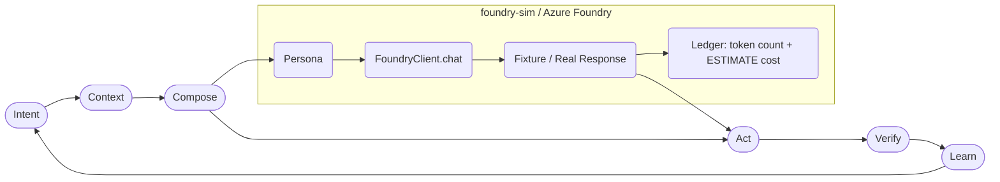

# foundry-sim — Local Offline Foundry Emulator

```text
┌─ F O U N D R Y - S I M  //  A o T  C O M M U N I T Y ─────────────┐
│  LOCAL OFFLINE EMULATOR  ×  ZERO COST  ×  NO NETWORK CALLS         │
│  FOUNDRY_MODE=sim  ·  All figures labeled ESTIMATE                 │
└──────────────────────────────────────────[ SIM → REAL = config ]───┘
```

**A local, offline, zero-cost emulation of Azure AI Foundry** so you can see the visuals, build personas and workflows, and judge ROI _before_ connecting any real Azure keys or incurring any spend.

> **This package makes no network calls and incurs no cost.** It runs entirely on your machine using Python 3.9+ standard library. No pip installs required.

---

## System prerequisites

| Requirement | Version | Notes |
| --- | --- | --- |
| Python | **3.9 or newer** | Standard library only — no packages to install |
| bash | any | Required to run `install.sh`; optional otherwise |

No other system packages, pip dependencies, virtual environments, or external services are needed. Everything runs fully offline.

---

## Installation

### One-command bootstrap (recommended)

Run from the repository root:

```bash
bash foundry-sim/install.sh
```

This single command:
1. Verifies Python 3.9+ is available and prints an actionable error if not
2. Confirms all required source files are present
3. Validates all fixture JSON files
4. Runs the full test suite (all offline)
5. Runs a minimal smoke test of `dash.py` and `FoundryClient`

It is **safe to run repeatedly** (idempotent). No pip installs, no sudo, no network calls.

#### Prerequisite-check only

```bash
bash foundry-sim/install.sh --check
```

Runs checks 1–4 above and exits. Use this in CI or before committing changes to verify the environment is clean without executing the full test run.

### Manual verification (no script)

If you prefer not to use the shell script, run these commands manually from the repository root:

```bash
# 1. Check Python version (must be 3.9+)
python --version

# 2. Run the test suite
python -m unittest foundry-sim/tests/test_sim.py -v

# 3. Smoke-test the dashboard
python foundry-sim/dash.py

# 4. Smoke-test the client
python - <<'EOF'
import sys; sys.path.insert(0, "foundry-sim")
from foundry_client import FoundryClient
client = FoundryClient()
resp = client.chat([{"role": "user", "content": "Help me frame a strategy brief."}],
                   record_to_ledger=False)
print(resp["choices"][0]["message"]["content"])
print("sim_note:", resp["sim_note"])
EOF
```

### Continuous integration

GitHub Actions runs `bash foundry-sim/install.sh` automatically (workflow:
`.github/workflows/foundry-sim.yml`) on every pull request or push that touches
`foundry-sim/`, across Python 3.9 through 3.14. Local developers run the exact
same command — there is no separate CI script. The simulator needs **no Azure
credentials** in CI or anywhere else; Azure mode remains future work
(see `docs/PRD-azure-foundry-integration.md`).

---

## What it is

`foundry-sim` is a staging layer that:

1. **Mirrors the Azure OpenAI client interface** — `client.chat(messages)` returns the same response shape you'd get from the real Azure OpenAI API, so switching to the real client is a configuration change, not a rewrite.
2. **Returns deterministic canned responses** from `fixtures/` — fictional, non-sensitive data that exercises the full AoT loop without touching any API.
3. **Tracks simulated token usage and estimated cost** in `ledger.json` using configurable rates from `rates.json`, so you can project burn rate against your Azure Startup Credits before spending anything.
4. **Displays a terminal dashboard** (`dash.py`) with emulated topology, per-run token counts, and an ESTIMATE-labeled cost/ROI table.
5. **Provides scaffolding** (`personas/` and `workflows/`) that the maintainer owns and builds out — clean, documented extension points.

## What it is NOT

- **Not a live Azure integration.** `FOUNDRY_MODE=azure` raises a clear error and directs you to `docs/PRD-azure-foundry-integration.md`.
- **Not a billing system.** All cost figures are labeled ESTIMATE and are local math only.
- **Not a showcase of agent logs.** No session transcripts are captured, stored, or displayed.

---

## Quick start

```bash
# 1. Run the terminal dashboard (no installs needed)
python foundry-sim/dash.py

# 2. Add demo runs to populate the ledger, then display
python foundry-sim/dash.py --demo

# 3. Run the tests
python -m unittest foundry-sim/tests/test_sim.py -v

# 4. Use the client in your own scripts
python - <<'EOF'
import sys; sys.path.insert(0, "foundry-sim")
from foundry_client import FoundryClient
client = FoundryClient()
resp = client.chat([{"role": "user", "content": "Help me frame a strategy brief."}])
print(resp["choices"][0]["message"]["content"])
EOF
```

---

## The sim / azure seam

The only difference between sim mode and the real Azure mode is one environment variable:

| `FOUNDRY_MODE` | Behaviour |
| --- | --- |
| `sim` (default) | Returns fixture responses. No network. No cost. |
| `azure` | Calls a real Azure OpenAI deployment. Guarded by an allowlist, per-run caps, and a separate ledger. See `docs/PRD-azure-foundry-integration.md`. |

In `auto` profile (`SIM_PROFILE=auto`, the default), the simulator does not pin a specific paid model. It emulates generic response behavior so you can layer personas and workflows on top of whatever the Copilot auto engine routes to. When you're ready to connect, you add the Azure env vars and flip `FOUNDRY_MODE=azure` — the `client.chat()` interface does not change.

### Azure mode guardrails

Azure mode is real spend, so it ships with hard guards (all enforced in `foundry_client.py`):

- **Allowlist:** only Tier 1 first-party mini deployments (e.g. `gpt-5.4-mini`) are accepted. Full-size models require maintainer approval; unknown names are rejected outright.
- **Per-run caps:** max 50 requests and $1.00 estimated cost per client instance; 4096 max completion tokens per call; 30s timeout.
- **Auth:** Entra ID bearer token via `az` CLI (no keys needed). `AZURE_OPENAI_API_KEY` is a local-dev fallback only.
- **Separate ledger:** real runs go to `foundry-sim/ledger.azure.json`, which is **git-ignored** — the sim's committed `ledger.json` never mixes with real spend. Cost figures are ESTIMATEs from `rates.json`; token counts are actual.
- **CI never runs azure mode.** The workflow has no Azure credentials and no login step by design.

### Environment variables

| Variable | Default | Description |
| --- | --- | --- |
| `FOUNDRY_MODE` | `sim` | `sim` for offline emulation; `azure` for the real, guarded integration. |
| `SIM_PROFILE` | `auto` | Persona profile hint. `auto` = no pinned model; matches Copilot auto routing. |
| `AZURE_OPENAI_ENDPOINT` | _(unset)_ | Azure mode: full endpoint URL, e.g. `https://<resource>.cognitiveservices.azure.com/`. |
| `AZURE_OPENAI_DEPLOYMENT` | _(unset)_ | Azure mode: deployment name — must pass the Tier 1 allowlist (e.g. `gpt-5.4-mini`). |
| `AZURE_OPENAI_API_VERSION` | _(unset)_ | Azure mode: optional API version override for the legacy endpoint path. |
| `AZURE_CLIENT_ID` | _(unset)_ | Azure mode: Entra ID managed identity hint (optional). |
| `AZURE_OPENAI_API_KEY` | _(unset)_ | Azure mode: local-dev fallback auth only. Prefer `az login`. |
| `FOUNDRY_LEDGER_PATH` | _(unset)_ | Azure mode: override the azure ledger location (defaults to `foundry-sim/ledger.azure.json`). |

See `.env.example` in the repository root for the full list of names. **Never commit real credentials to the repository.**

---

## Optional components

All components are included in the repository checkout — there is nothing to download separately.

| Component | Status | Notes |
| --- | --- | --- |
| `fixtures/` | Required | Three canned response fixtures (strategy-brief, workflow-review, rubber-duck) |
| `rates.json` | Required | ESTIMATE token-rate table used by ledger cost calculations |
| `personas/` | Optional | Scaffolding — add your own persona JSON files following the schema in `personas/README.md` |
| `workflows/` | Optional | Scaffolding — add your own workflow JSON files following the schema in `workflows/README.md` |
| `ledger.json` | Runtime-generated | Created/updated by `FoundryClient.chat()` and `dash.py`; committed as an empty seed |

---

## Directory layout

```
foundry-sim/
├── README.md                  ← this file
├── install.sh                 ← idempotent one-command bootstrap + test runner
├── foundry_client.py          ← client shim (stdlib only)
├── dash.py                    ← terminal dashboard (stdlib only)
├── rates.json                 ← configurable ESTIMATE rate table
├── ledger.json                ← simulated cost ledger (runtime-generated seed)
├── fixtures/
│   ├── strategy-brief.json    ← canned response: strategy discovery
│   ├── workflow-review.json   ← canned response: workflow clinic
│   └── rubber-duck.json       ← canned response: rubber-duck debugging
├── personas/
│   ├── README.md              ← schema + how to add personas
│   └── example-reviewer.json  ← EXAMPLE persona (maintainer builds out)
├── workflows/
│   ├── README.md              ← schema + how to add workflows
│   └── example-research-synthesis.json  ← EXAMPLE workflow (maintainer builds out)
└── tests/
    └── test_sim.py            ← stdlib unittest, no installs required
```

---

## Troubleshooting

### `python: command not found`

Try `python3` instead of `python`. On some systems the default Python is version 2:

```bash
python3 --version
python3 -m unittest foundry-sim/tests/test_sim.py -v
```

### `SyntaxError` or `TypeError` on import

Check your Python version. This project requires **Python 3.9 or newer**:

```bash
python --version   # must be 3.9+
```

### Tests fail with `ModuleNotFoundError: No module named 'foundry_client'`

Run tests from the repository root, not from inside `foundry-sim/`:

```bash
# correct — from repository root
python -m unittest foundry-sim/tests/test_sim.py -v

# also correct
python foundry-sim/tests/test_sim.py
```

### `FOUNDRY_MODE=azure` fails with an allowlist or endpoint error

Azure mode requires `AZURE_OPENAI_ENDPOINT` and an allowlisted `AZURE_OPENAI_DEPLOYMENT` (Tier 1 mini models only — see `docs/PRD-azure-foundry-integration.md` §5.1). Full-size model names are rejected until a maintainer approves them; unknown names are always rejected. Authenticate with `az login` first — the client fetches an Entra bearer token via the `az` CLI.

### `ledger.json` accumulates run data locally

Run `python foundry-sim/dash.py --demo` to add demo data. To reset the ledger, restore the seed file:

```bash
git checkout foundry-sim/ledger.json
```

### `bash foundry-sim/install.sh` fails on Windows

Use Git Bash, WSL, or run the manual verification steps directly with Python. The `install.sh` script requires a bash-compatible shell.

---

## Extending the simulator

### Add a persona
Copy `personas/example-reviewer.json`, edit the fields, and use the `system_prompt` as the first message (`role: "system"`) in your `client.chat()` calls. See `personas/README.md` for the full schema.

### Add a workflow
Copy `workflows/example-research-synthesis.json`, edit the steps, and iterate over them in your script. See `workflows/README.md` for the full schema.

### Add a fixture
Add a new `.json` file to `fixtures/` following the existing structure: an `id`, a `messages` array, and a `response` object matching the Azure OpenAI ChatCompletion shape. The client will pick it up automatically.

### Adjust rate estimates
Edit `rates.json` to update the ESTIMATE placeholder rates. The dashboard and ledger will reflect the new values on the next run. These figures are estimates only — see the note in `rates.json`.

---

## Mermaid: AoT loop wired to Foundry



---

## When you're ready to connect to Azure

1. Read `docs/PRD-azure-foundry-integration.md` — it covers Entra ID auth, the first-party-only model allowlist, Startup Credits guardrails, and budget alerts.
2. Add the Azure env vars to your environment or GitHub secrets (never to the repository).
3. Set `FOUNDRY_MODE=azure`.
4. The `FoundryClient` interface is identical — no code changes in your personas or workflows.

> **Startup Credits note:** Microsoft for Startups credits apply to first-party Azure OpenAI deployments only. Third-party / Marketplace models in Foundry (e.g., Anthropic Claude, Fireworks) bill directly even when credits are unused. See `docs/PRD-azure-foundry-integration.md` §5 Startup Credits Guardrails.
