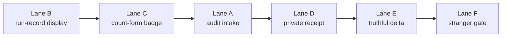

# v0.1 vibe-coding foundation — six lanes to the stranger gate

This is the execution plan for finishing v0.1. It sequences only the outstanding
work; everything already merged (schemas, hygiene runner, BYOC reusable workflow,
self-audit run-records, Astro teardown, Watchdog Ducky) is treated as foundation,
not repeated.

## The one sentence that governs everything

> A stranger signs in with GitHub, picks their repository, runs a Tier A hygiene
> audit in their own Actions, reads a private receipt, fixes one finding, re-runs,
> sees a truthful delta, and shares a count-form badge — with no maintainer help.

Every lane below either advances that sentence or it does not ship in v0.1.

## What exists today (verified, not assumed)

| Building block | Where | State |
| --- | --- | --- |
| Tier A hygiene runner + validator | `scripts/audit/hygiene.py`, `validate.py` | Merged, tested |
| Run-record contract | `schemas/run-record.schema.json` | Merged (keystone) |
| Real run-records (self-audit) | `docs/audits/run-records/run-1..3.json` | Run 3 = 7/7 |
| Stranger-runnable BYOC workflow | `.github/workflows/hygiene-audit-reusable.yml` | Merged, SHA-pinnable |
| Identity / ownership / SHA gate | `agent-worker/src/repository-verification.ts` | Merged (never runs hygiene) |
| GitHub SSO plumbing | `agent-worker/src/auth.ts` | Merged (token discarded) |
| Clean Astro surface | `catalog-site/` post-#51 | Mock density removed |
| Scope enforcement | `.watchdog-rules.json` + Ducky action | Live on every PR |

## What is outstanding (the six lanes)

Ordered so each lane hands real material to the next. One lane = one PR = one
Ducky-guarded review. No lane may touch a frozen item (threads, cohort ledger,
KNOWS tags, watching, paid tier, gh-curations CLI).

### Lane B — Real run-record display (start here)

- **Goal:** the Astro site renders our three real self-audit run-records as
  dense Board rows — repo, pinned `commit_sha` (short), `ruleset_version`,
  `passed/total`, timestamp. Nothing invented, nothing mock.
- **Why first:** it is pure visual proof built on data that already exists in
  the repo. Zero backend risk, immediate credibility, and it forces the
  run-record contract through a real consumer for the first time.
- **Smallest falsifying proof:** delete the run-record JSON files locally and
  the section must render an honest empty state — if placeholder rows appear,
  the lane has failed its own principle.
- **Touches:** `catalog-site/src/` (new data loader + one section), visual
  proof screenshots in `docs/visual-proofs/`.
- **Guardrails:** Visual Oracle rules (dense rows, mono metadata, zero radius,
  hairline separators, hard shadows); `catalog-site/AGENTS.md` read first.

### Lane C — Count-form badge

- **Goal:** a generated badge artifact per run-record — exactly
  `Tier A: 7/7 · hygiene/0.1.0` — as SVG plus copy-paste README markdown,
  linking back to the run-record display from Lane B.
- **Why second:** the badge is the shareable object that makes the loop social;
  it needs Lane B's display as its landing target. Roadmap "Next" names it.
- **Smallest falsifying proof:** regenerate the badge from `run-3.json` and
  diff — output must be byte-identical (deterministic from the record). Any
  gold/silver/bronze wording appearing anywhere is an automatic fail.
- **Touches:** `scripts/audit/` (badge generator), `catalog-site/` (badge
  snippet block on the run-record view).
- **Guardrails:** count-form only; no quality labels, no scoring bands (frozen).

### Lane A — Audit intake surface

- **Goal:** the site's missing front door: sign in with GitHub → see repos you
  actually control (via `repository-verification.ts`) → get the one-click BYOC
  instructions (pinned-SHA reusable workflow) for that repo.
- **Why third:** with display + badge live, a stranger finally has a reason to
  walk through the door. Worker verification and SSO already exist — this lane
  is mostly wiring and one honest page, not new trust machinery.
- **Smallest falsifying proof:** a signed-in user attempting to submit a repo
  they do not control must be refused with a plain-language reason. If it goes
  through, the identity gate has failed.
- **Touches:** `catalog-site/src/pages/` (new intake page), `agent-worker/src/`
  (route wiring only — verification logic stays untouched).
- **Guardrails:** provider token discarded after sign-in; hygiene never runs on
  our infrastructure; no silent fallback to CURATIONS-funded compute.

### Lane D — Private receipt, explicit publish

- **Goal:** audit results land privately for the repo owner first; publishing
  to the public display is a separate explicit act. Security-shaped findings
  are never publishable — only their count is.
- **Why fourth:** this is the trust promise of the Evidence Registry PRD, and it
  must exist before strangers submit real repos with real findings.
- **Smallest falsifying proof:** run an audit with a seeded security finding —
  the public record must show only the count while the detail remains
  owner-visible. Detail leaking to any public surface is an automatic fail.
- **Touches:** `agent-worker/src/` (receipt state + publish action),
  `catalog-site/` (owner-only receipt view, publish affordance).
- **Guardrails:** owner-only visibility default; revocation path preserved per
  Evidence Registry PRD.

### Lane E — Re-run and truthful delta

- **Goal:** a second run on the same repo links `previous_run`, and the display
  shows an honest delta — exactly which checks changed, no smoothing, no spin.
- **Why fifth:** the fix-and-re-run moment is where the product proves it tells
  the truth; it is also the release-gate metric's engine (first-fix rate).
- **Smallest falsifying proof:** re-run with zero changes — the delta must say
  "no change" rather than manufacturing improvement. Run 2 → Run 3 history
  (5/7 → 7/7) must reproduce as the canonical example.
- **Touches:** `scripts/audit/` (lineage), `catalog-site/` (delta row).
- **Guardrails:** deltas computed only from schema-valid records with matching
  `ruleset_version`.

### Lane F — Stranger gate rehearsal (release gate)

- **Goal:** run the full seven-step loop as a stranger would — fresh account,
  unaffiliated repo, no maintainer help — and record the walkthrough as a
  visual proof plus a written gap log.
- **Why last:** it is the release gate itself. v0.1 does not ship until this
  passes; target ≥60% first-fix success.
- **Smallest falsifying proof:** the rehearsal log shows any step requiring
  tribal knowledge, maintainer intervention, or an undocumented flag.
- **Touches:** `docs/` (rehearsal record, visual proofs). No product code —
  fixes discovered here become scoped follow-ups in the responsible lane.

## Sequence and dependencies

Lanes B and C are pure visual-proof work on existing data — lowest risk, highest
immediate credibility. Lanes A, D, E add the stranger-facing machinery in trust
order. Lane F is the gate, never skipped.

## Standing rules for every lane

1. One lane, one PR, one review — Watchdog Ducky guards scope on each.
2. Plan gate before code: restate the lane's falsifying proof in the PR body.
3. Two-pass review: spec conformance, then code quality.
4. Visual lanes ship with before/after screenshots in `docs/visual-proofs/`.
5. Real data only — an honest empty state always beats a convincing mock.
6. Frozen items stay frozen; the Ducky enforces, humans decide exceptions.
7. Agents prepare and recommend; Wyatt approves and merges.
